<h1>
  
  Cos — your chief of staff.
</h1>

<h1>
  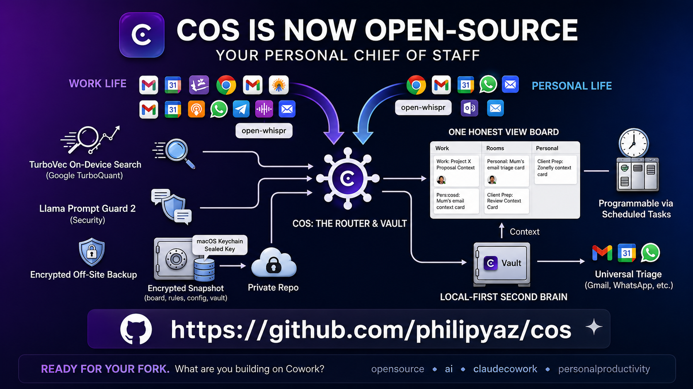
</h1>

**You have two lives — work and personal. Cos is where they finally meet.**

> The persistent memory and judgment layer your agentic OS lacks — owned by you.

[](./LICENSE)
[](https://claude.com)
[](https://nodejs.org)
[](./CONTRIBUTING.md)
[](#architecture)
[](https://philipyaz.github.io/cos/)

*[See it ↓](#a-look-inside) — screenshots of every view. Animated demo (coming soon): a noisy inbox collapses into one triaged board card and a linked vault page — noise in, signal out.*

---

## Two lives, one you.

Work wants you on top of everything — the thread you can't drop, the ask buried three replies deep, the deadline nobody flagged. Your personal life runs underneath it all day: your partner on WhatsApp, an unplayed voice note, your mum's email about the weekend. No one holds both, so you become the **router** — wiring every message to the person, the history, the next move, by hand. One world ends up handled; the other, three days behind.

## Meet Cos.

Cos takes the router job. It reads your work email *and* your personal WhatsApp, watches your calendar and voice notes, decides what actually needs *you*, and lays work and life on **one board** — while quietly building a **vault**: a private second brain that remembers every person, deal, and decision, so the context is already there when you need it. The two worlds you could never hold at once, finally in one place.

And it's **lightweight by design.** Cos is a layer on **Claude Cowork**, not a new assistant to host — Cowork is the brain that reads, classifies, and routes; Cos gives it the board, the vault, and the tools to act. No separate agent server, no VPS, no second phone number to stand up the way self-hosted stacks ask for. You instruct it the way you already talk to everyone — drop a note in WhatsApp or email — and schedule it to sweep your channels on a regular basis: triaging the noise, opening and updating cases, running the recurring work — a [starter set of recipes](#recipes--what-to-schedule-in-cowork) is below. All it needs is your machine on and connected; reach it from Claude when you're away from your desk.

## What it does

- **🗂️ Work and life on one board.** The quarterly plan and the dentist, the client thread and your mum's message — one writable kanban of *what's left to do*, not two systems and a head full of the gaps between.
- **📥 Every channel, one triage.** Cos reads your **Gmail, WhatsApp, calendar, and voice notes**, resolves each message to the person and history behind it, and turns the handful that genuinely need you into board cards. The noise gets filtered down — you can always see the full feed, you just don't have to live in it.
- **🧠 A second brain that compounds.** Every source you feed it gets read and *re-synthesized* into a private, interlinked wiki — one note can rewrite a dozen connected pages, so people, deals, and decisions stay consistent and current over time. Context survives between sessions instead of evaporating; Cos walks into every conversation already briefed.
- **✋ You stay in control.** Cos keeps an append-only **activity log** of every change to the board — one feed you can filter by `human` / `agent`, so you can always see what the agent did, when, and tell its edits from your own.
- **🔒 Private and safe by default.** Your email, messages, voice notes, and second brain stay **on your machine** — local, gitignored, never committed. Untrusted mail is scanned for prompt-injection *before* any agent reads it, and the scanner **fails closed**: a down guard treats content as untrusted, never a false all-clear.

> 🔬 **Want the engineering depth** — on-device semantic search (turbovec + model2vec), the Llama-Prompt-Guard injection gate, AES-256-GCM off-site backups, a schema-versioned store, 60+ MCP tools? **[→ The deep feature tour](docs/reference/deep-features.md).**

## A look inside

One local-first board where work and life meet — with a live activity log, a private vault, and the triage that feeds them.

<p align="center">
  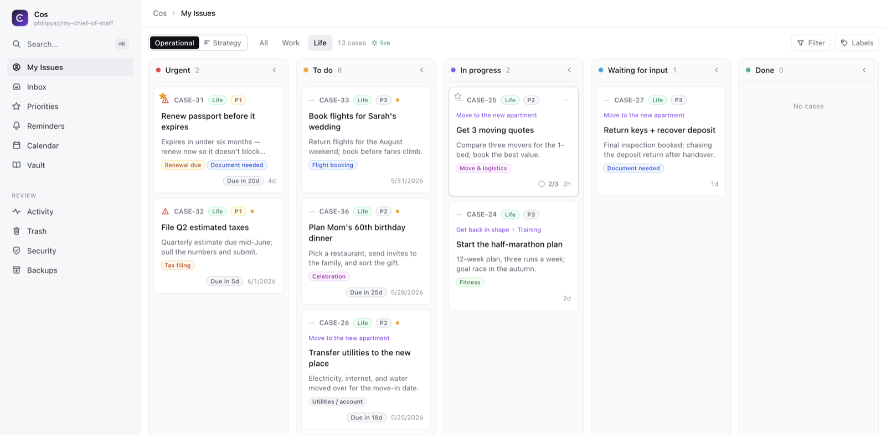
</p>

<details>
<summary><b>More screens</b> — priorities, inbox triage, calendar, reminders, vault, security, backups, activity, trash, and Cos driven from Claude Cowork</summary>

<br/>

<table width="100%">
  <tr>
    <td width="50%">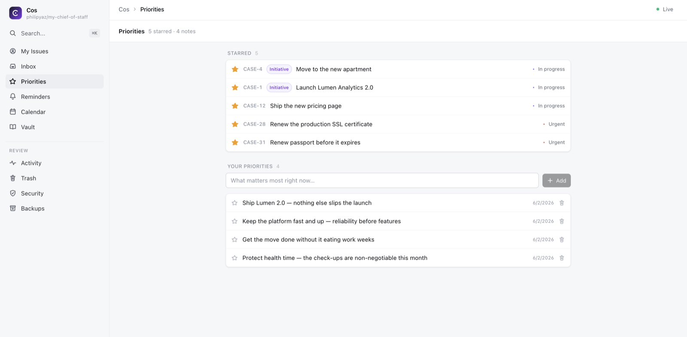<br/><b>Priorities</b> — what actually needs you, today</td>
    <td width="50%">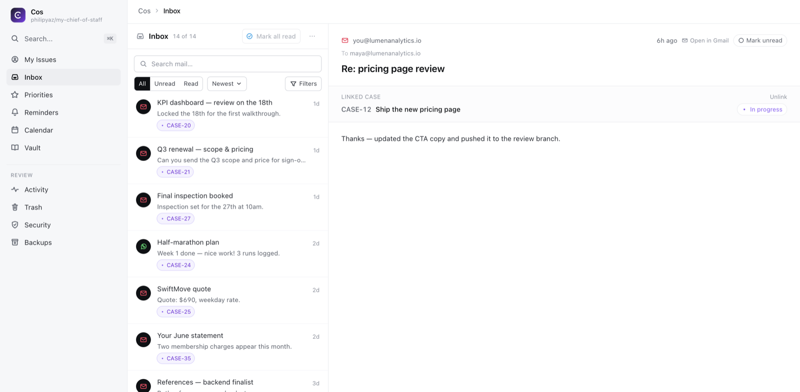<br/><b>Inbox</b> — Gmail, WhatsApp &amp; voice notes, one triage</td>
  </tr>
  <tr>
    <td>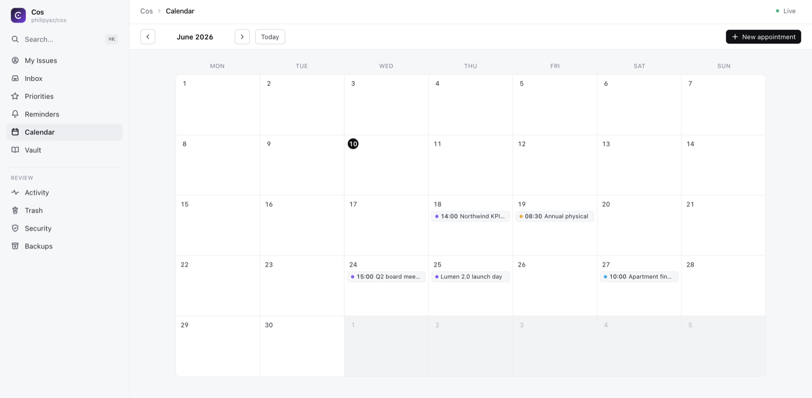<br/><b>Calendar</b> — the week at a glance</td>
    <td>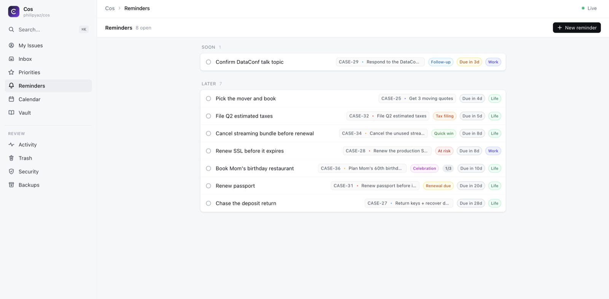<br/><b>Reminders</b> — time-based nudges</td>
  </tr>
  <tr>
    <td>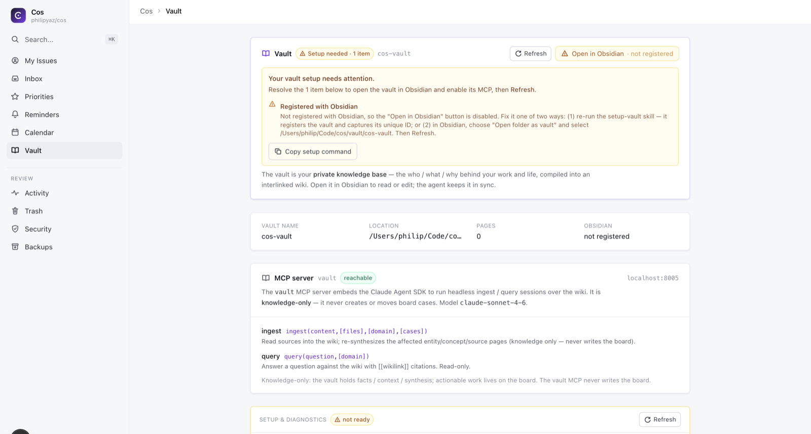<br/><b>Vault</b> — the private, interlinked second brain</td>
    <td>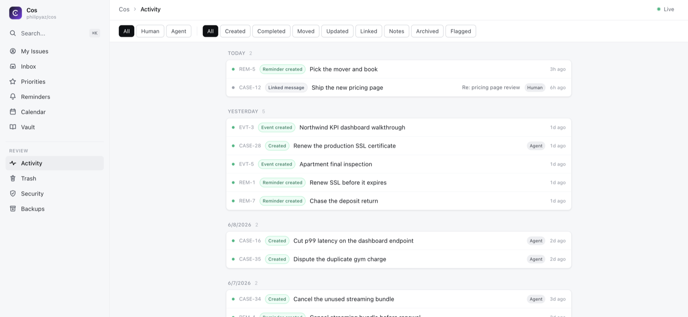<br/><b>Activity</b> — every change: human / agent</td>
  </tr>
  <tr>
    <td>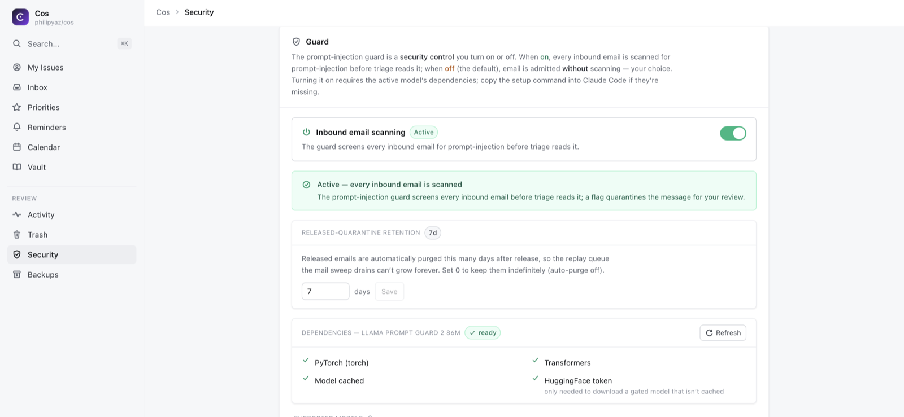<br/><b>Security</b> — the prompt-injection Guard &amp; quarantine</td>
    <td>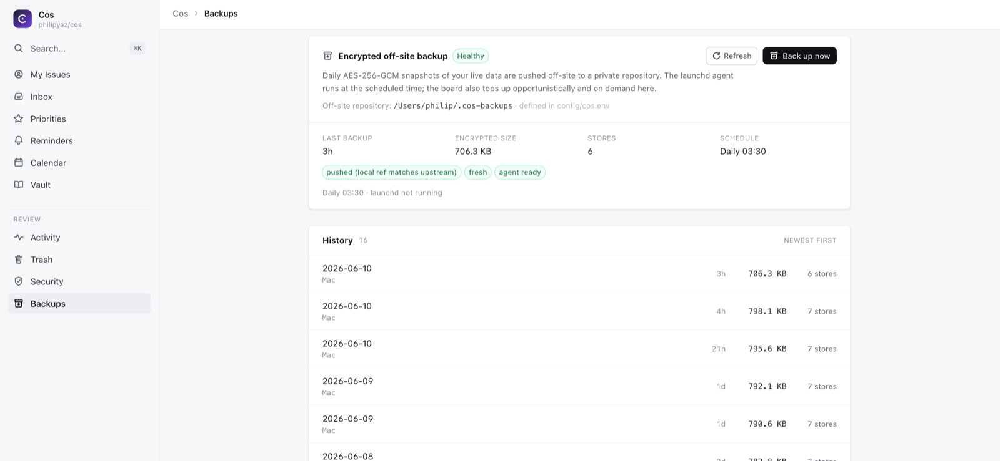<br/><b>Backups</b> — encrypted, off-site snapshots</td>
  </tr>
  <tr>
    <td>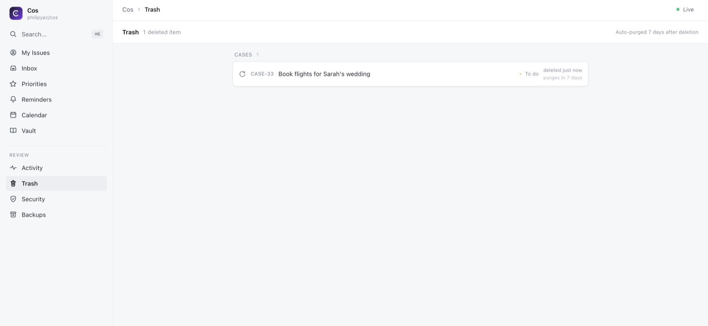<br/><b>Trash</b> — soft-delete with 7-day retention</td>
    <td>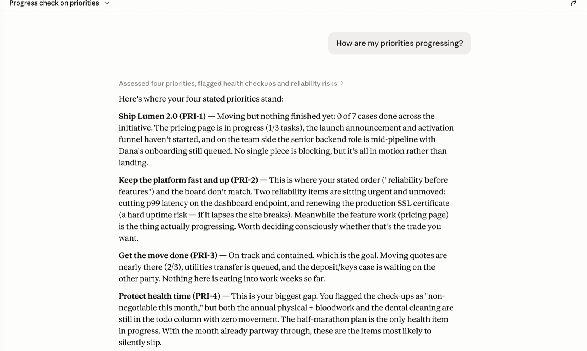<br/><b>In Claude Cowork</b> — drive the board by chat</td>
  </tr>
  <tr>
    <td>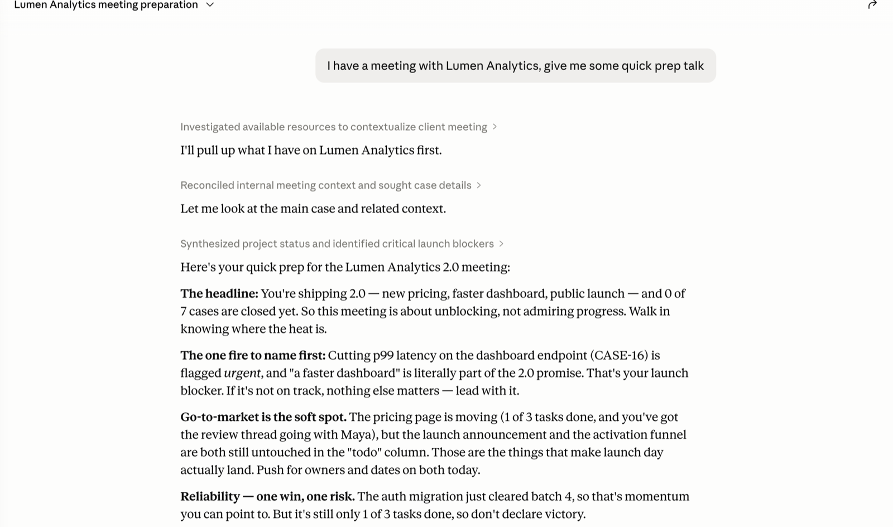<br/><b>Meeting prep</b> — Cos briefs you from the vault</td>
    <td></td>
  </tr>
</table>

</details>

## Architecture

Two pillars, one operator. The agent drives both surfaces; so do you.

```
   voice · email · WhatsApp · calendar          you — from your phone
                  │                                      │
                  │                            ┌─────────▼─────────┐
                  │                            │  Claude Dispatch  │  remote control: reach
                  │                            │  converse · add   │  Cos from anywhere
                  │                            │   to the board    │
                  │                            └─────────┬─────────┘
         ┌────────▼──────────────────────────────────────▼────────┐
         │              Claude Cowork  (the agent)                 │  the operator — classify & route
         └─────────────────┬────────────────────────┬─────────────┘
              knowledge     │                        │  action
                ┌───────────▼─┐                 ┌────▼────────┐
                │   VAULT      │◄───────────────►│    BOARD    │
                │  second      │                 │  kanban of  │
                │  brain       │                 │ what's left │
                └──────────────┘                 └─────────────┘
          GUARD (fail-closed)  ·  SEARCH (semantic)  ·  MCP (exposes it all)
```

- **Dispatch** — your remote control: message **Claude Dispatch** from your phone to converse with Cos and drop new cases straight onto the board while you're away from your desk. Cowork picks the task up on your machine, with your local files, skills, and tools. See [Claude Cowork Dispatch](https://support.claude.com/en/articles/13947068-assign-tasks-from-anywhere-in-claude-cowork).
- **Board** — a writable kanban of *what's left to do*, work and life on one honest view. Every human gesture is the visual twin of a board verb the agent already calls. See [Features](docs/features/board.md), [Hierarchy](docs/architecture/hierarchy.md).
- **Vault** — your *second brain*: a compounding context fingerprint as a local Obsidian LLM-Wiki, cross-linked to the cases it informs. See [Spec](docs/architecture/spec.md).
- **Guard** — a fail-closed prompt-injection scanner that reads untrusted mail *before* the agent does. See [Guard](docs/security/guard.md).
- **Search** — an optional semantic-search sidecar with keyword fallback. See [Search](docs/reference/search.md).
- **MCP servers** — `board · openwhispr · calendar · guard · vault` (five core) expose it all to agents over local stdio, with an optional **WhatsApp** add-on. The full inventory is in [the deep feature tour](docs/reference/deep-features.md).

## Quickstart (30 seconds)

```bash
git clone https://github.com/philipyaz/cos.git
cd cos
```

Then run the **`cos-setup`** skill in **Claude Code** — the single first-run entry point. It sequences the four component setups in dependency order:

```
setup-vault → guard-setup → mcp-bridge-setup → backup-recovery
```

When it finishes, open the board at your `$BOARD_URL` (`http://localhost:$BOARD_PORT` by default) and start triaging.

### Manual quickstart (just the board)

Want to kick the tires on the board alone, without wiring the MCP bridges, vault, or Guard? You can run just the Next.js app:

```bash
source "$(git rev-parse --show-toplevel)/config/load-config.sh"   # exports $BOARD_PORT, $BOARD_URL, paths
cd board
npm install
npm run dev                                                       # board on $BOARD_URL (http://localhost:3000 by default)
```

Then open `$BOARD_URL` (`http://localhost:$BOARD_PORT`, default `http://localhost:3000`). The board's `dev` script first runs `mcp/ensure-bridges.sh`, which only **nudges** the optional MCP bridges + search sidecar — a cold or absent bridge just WARNs and the app still starts, so the bridges are optional for a board-only run. For the full system (vault, Guard, MCP servers for Claude Code / Cowork, off-site backup), run the **`cos-setup`** skill above instead.

## Recipes — what to schedule in Cowork

Setup is the boring half; the fun is what you make of it. Cowork runs [**scheduled tasks**](https://support.claude.com/en/articles/13854387-schedule-recurring-tasks-in-claude-cowork) — type `/schedule`, pick a cadence (hourly, daily, weekly, weekdays), and Cos runs the routine on its own against your local board and vault. A starter set worth wiring up on day one — paste each as the task's prompt, then write your own:

- **🧹 Triage sweep** · *hourly–daily* — **the two essential routines that keep the board live.** Schedule both on day one: [**`/mail-to-board`**](https://github.com/philipyaz/cos/tree/main/board/.claude/skills/mail-to-board) reconciles **Gmail** onto the board and [**`/whatsapp-triage`**](https://github.com/philipyaz/cos/tree/main/board/.claude/skills/whatsapp-triage) does the same for **WhatsApp** — each sweeps *both* received and sent messages, scans anything untrusted through Guard first, resolves every thread to the person and case it belongs to, opens or updates the cards that genuinely need you, keeps one card per matter, and **never undoes a manual edit**. Run them as their own scheduled tasks (paste `/mail-to-board` and `/whatsapp-triage` as the prompts), or sweep everything at once: *"Sweep my Gmail, WhatsApp, and new voice notes since your last run. Scan anything untrusted through Guard first, resolve each message to the person and case it belongs to, open or update board cards for what genuinely needs me, and leave the rest in the feed."*
- **☀️ Morning brief** · *weekdays, 7am* — *"Read my board priorities and today's calendar, then message me a short brief: what's on top, what moved overnight, what's waiting on me, and the one thing I shouldn't drop today."*
- **🤝 Meeting prep** · *6am, for the day ahead* — *"For each meeting on my calendar today, pull everything the vault knows about the people and the deal plus the latest threads, and draft a one-page prep card linked to the case."*
- **🗂️ Weekly board strategy** · *Sunday evening* — *"Regroup loose cases into the right workstreams and initiatives, re-check P0–P3 priorities against what's actually moving, flag anything stuck waiting-for-input too long, and queue the changes for my approval."*
- **🧠 Vault upkeep** · *Fridays* — *"Ingest this week's resolved cases, notes, and voice transcripts, and re-synthesize the people and deal pages so the second brain stays current."*

The same guardrails hold on a timer as in person: untrusted mail is scanned **before** it's read (the scanner fails closed), and every change a scheduled run makes lands in the same **activity log** — attributed to `agent` — for you to review, with anything that should have you in the loop **proposed** rather than done. Scheduled tasks run while your machine is awake and Cowork is open; miss a window and the run catches up next time.

Each recipe is just a prompt over the same **board** and **vault** — which is the whole point. The two compound until Cos is two things at once: **an efficient context layer for your agents, and a clarity layer for you.**

## Why not just…?

- **…vanilla Cowork / Claude alone?** Cos adds the **persistent memory and judgment** the agentic OS lacks — a compounding vault and a stateful board, so context survives between sessions instead of evaporating.
- **…a generic to-do app?** A to-do list doesn't read your inbox, resolve a sender to a person and their history, or know *which* messages deserve a card. Cos triages the noise *into* the list.
- **…an inbox-zero tool?** Those move email around. Cos isn't another inbox — it's a clarity layer that turns inbound into *what's left to do* plus *the context behind it*.
- **…a self-hosted agent like OpenClaw or Hermes?** Those are standalone runtimes you host and maintain — a VPS, a gateway, often a second phone number. Cos rides on the Claude Cowork you already run: no new server, no extra infra, just your machine and the accounts you already use.

## FAQ

**How does it run day to day?** You give Cos instructions in plain language — in Claude, or by dropping a note in WhatsApp or email — and Claude Cowork does the work, on demand or on a schedule — see **[Recipes](#recipes--what-to-schedule-in-cowork)** for routines worth setting up. All it needs is your machine on and connected; there's no separate server to host.

**What leaves my machine?** Your vault, board data, and voice transcripts live in local files (gitignored). Cos only reaches out to the services you connect — Anthropic for the model, and Gmail / Google Calendar / WhatsApp if you wire them.

**Do I need a paid Claude / Cowork plan?** Cos is a layer on Claude Cowork and uses the Anthropic API, so you need access to those. Cos itself is open-source and free.

**What gets filtered vs. surfaced?** Communication noise (cold outreach, spray email) gets filtered down; what actually needs you becomes a board case linked to its context. You always see the full feed if you want it.

**Can I run without the vault, Guard, or WhatsApp?** Yes. The board stands on its own; the vault, Guard, search, and the WhatsApp add-on are optional layers you can add. Search has a keyword fallback, and Guard defaults to OFF — turn it on from the board's `/security` surface.

**Is it maintained?** Yes — active development. See the commit history.

## Contributing & more

- [📖 Documentation](https://philipyaz.github.io/cos/) — the full docs site (MkDocs · GitHub Pages); sources under [`docs/`](./docs)
- [🔬 Deep feature tour](docs/reference/deep-features.md) — the engineering-level inventory (models, algorithms, crypto, guarantees)
- [CONTRIBUTING.md](./CONTRIBUTING.md) — how to get involved
- [SECURITY.md](./SECURITY.md) — report a vulnerability
- [LICENSE](./LICENSE) — MIT

**⭐ If Cos makes your day quieter, [star this repo](https://github.com/philipyaz/cos).**
