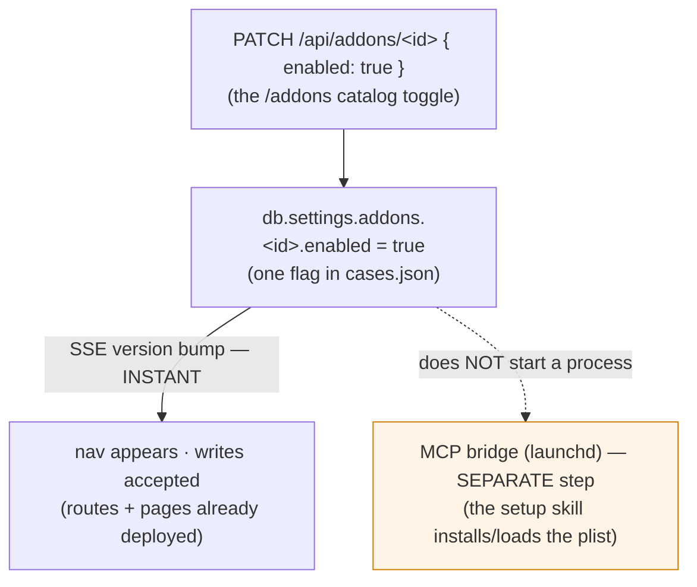

# Add-ons — optional verticals over the core

The core of Cos is small on purpose: cases, tasks, notes, messages, reminders, priorities, and
calendar events — the surfaces that are **always on** because every board needs them. But not every
board wants the *same* extra surfaces. Some people want a food log; others never will. An **add-on**
is how Cos grows a new vertical — a whole feature area — **without bloating the core** and without
forcing it on anyone: it ships **disabled by default**, and a board only carries the cost of an
add-on it has explicitly switched on.

The headline idea is that an add-on is a **full slice of the system, gated by one flag**. A core
feature reaches across four layers — a **nav** entry, an **API** surface, the **data** it owns, and
an **MCP server** that exposes it to the agent. An add-on is exactly that same four-layer slice,
bundled behind a single per-board toggle. Turning it on reveals its nav and starts accepting its
writes; turning it off hides the nav and refuses new writes — while the data it already holds stays
**readable** the whole time.

So far there are **two** add-ons — **[Nutrition & Chef](../features/nutrition.md)** (the food log,
the pantry, and the meal plan) and **[Fitness](../features/fitness.md)** (Apple Watch
ingestion + an AI training coach) — but the framework is built to take more. This page is the
framework; the two feature pages are the worked examples. (Fitness also exercises the
[optional inter-add-on dependency](#optional-inter-add-on-dependencies-dependson) — it reads
nutrition's food log when it is present.)

## What an add-on is — the four layers

An add-on is an **optional, self-contained vertical layered over the core board**. It contributes
exactly four things, and nothing about it is special-cased in the core — it is the same machinery the
core uses, parametrised by a manifest.

A component (the core **and** every add-on) is a **deterministic state machine**: it persists state
and exposes it via an **API + an MCP server**, and it **does not call an LLM** — any generative step
is done by the **external agent** and written back through the API/MCP (the board's job is to
validate, version, attribute, and serve). Deterministic server-side **compute** is fine; only
*generative inference* is delegated. (The sole LLM-bearing component in the repo is the **vault MCP**,
which embeds the Claude Agent SDK — see the repo-root
[`CLAUDE.md`](https://github.com/philipyaz/cos/blob/main/CLAUDE.md).)

| Layer | What the add-on contributes | Where it lives |
|---|---|---|
| **Nav** | One or more sidebar entries (the add-on's pages), shown **only when enabled** | `navItems` in the manifest → the sidebar reads it |
| **API** | One or more `/api/*` route prefixes — `GET` (list) + `POST`, and `[id]` `GET`/`PATCH`/`DELETE` per resource | `apiPrefixes` in the manifest; the route files under `board/app/api/` |
| **Data** | One or more arrays on the core JSON store (`db.<array>[]`), minted with their own id prefixes | `dataArrays` in the manifest; the optional arrays on `DBShape` |
| **MCP server** | A stdio MCP server (the agent's twin of the add-on's UI), fronted by a launchd bridge | `mcp` block in the manifest; the server under `mcp/<name>-server/` |

The crucial design choice: **the add-on's data is not a new store.** Its arrays live in the *same*
`board/data/cases.json` as cases and events, are written through the *same* serialized `mutate()`
chokepoint, and ride the *same* `version` counter. That single decision is what makes the data
**free** in the two ways that matter most (see [below](#why-add-on-data-rides-the-core-store)).

## The manifest — the single source of truth

Every add-on is described by one **`AddonManifest`** entry in
[`board/lib/addons.ts`](https://github.com/philipyaz/cos/blob/main/board/lib/addons.ts). The registry
is **hand-authored** — one literal entry per add-on, no dynamic discovery, no plugin loader — so the
set of add-ons that exists is exactly the set in source, and the routes / layout / sidebar all read
their truth from this one module.

```ts
export interface AddonManifest {
  id: string;            // stable add-on key (the Settings.addons map key + the registry id)
  title: string;         // human display name
  description: string;   // one-line blurb for the catalog
  icon: string;          // key into components/icons.tsx
  navItems: { href; label; icon }[];   // the sidebar nav this add-on contributes
  apiPrefixes: string[];               // the /api/* prefixes this add-on owns
  dataArrays: (keyof DBShape)[];       // the db arrays this add-on owns
  mcp: {
    server: string;       // the MCP registry name (.mcp.json key)
    bridgePortVar: string;// the env var naming the bridge port (config/cos.env)
    defaultPort: number;  // the bridge port default (probed for reachability)
    setupSkill: string;   // the slash-skill that wires the bridge on a new machine
    tools: string[];      // the MCP tool names this server exposes
  };
  dependsOn?: { id: string; required: boolean }[];  // OPTIONAL soft/hard edges to other add-ons
}
```

An add-on carries no `core` marker — being **in `ADDON_REGISTRY` is** what makes it optional;
the core surfaces (cases/events/…) are simply never registered as add-ons. There is no dynamic
install: the registry is the exhaustive, hand-authored set.

The `ADDON_REGISTRY` is just `AddonManifest[]`, and four small helpers project off it — the entire
gate is these four functions, nothing more:

- **`listAddons()` / `getAddon(id)`** — the catalog and a lookup by id.
- **`isAddonEnabled(db, id)`** — `true` **only** when `db.settings.addons[id].enabled === true`. An
  absent `settings`, an absent `addons` map, or an absent entry **all read as off** — a board with no
  settings is a board with every add-on disabled.
- **`assertAddonEnabled(db, id)`** — the **write gate**: throws a `NotFoundError` (→ `404`) when the
  add-on is disabled. Every add-on **write** route calls this *inside* `mutate()`.

!!! note "The enabled flag is per-board data, not config"
    `db.settings.addons.<id>.enabled` lives in `cases.json`, not in `config/cos.env`. So the toggle
    is **board state** — it rides SSE and backup like everything else, and a restored backup restores
    your add-on choices. `installedAt` is stamped once on the first enable and preserved thereafter.

## The gate — writes close, reads stay open

The asymmetry is deliberate and is the whole behavioural contract of the framework:

- **Writes are GATED.** Every add-on mutation — `POST`, `PATCH`, `DELETE` on its routes — calls
  `assertAddonEnabled(db, id)` **inside the store lock**, before the write lands. A disabled add-on
  throws `NotFoundError`, which the route maps to a **`404`**. The MCP server surfaces that as a
  `Not found.` tool error. Putting the check inside `mutate()` (not just at the route edge) closes the
  TOCTOU: the gate and the write are one atomic critical section.
- **Reads stay OPEN.** Every `GET` is **ungated**. A disabled add-on's data remains fully readable —
  via the API, the read-only pages (when reachable), and the MCP read tools. Disabling an add-on
  **freezes** it; it never **hides or deletes** what it already holds.

This is why disabling is **safe and reversible**: you stop new writes without losing a byte, and
re-enabling picks up exactly where you left off.

## The activation model — nothing hot-loads

This is the part that most often trips people, so it is the most important thing on this page.
Enabling an add-on flips **one database flag**, and that flag reconciles **two very different kinds of
surface** with **very different activation costs**:



- **The Next.js side is already there.** The add-on's **routes and pages are statically compiled into
  the board build** — they are deployed whether or not the add-on is enabled. The flag does **not**
  add routes; it **un-gates** them. So enabling is **instant**: the toggle bumps `db.version`, SSE
  pushes the new version to every open tab, the sidebar reveals the nav group, and the write routes
  stop returning `404`. No rebuild, no restart.
- **The MCP server is a separate OS process.** The agent's twin of the add-on is a **stdio MCP server
  fronted by a launchd bridge** (a supergateway LaunchAgent, exactly like the core bridges — see
  [MCP servers](mcp-servers.md)). **Flipping the database flag does not start that process.** Nothing
  hot-loads a daemon. The bridge is **installed and loaded once, out of band**, by the add-on's
  **setup skill** (the `mcp.setupSkill` in the manifest) — it generates the plist from the service's
  descriptor (`mcp/<name>-server/<name>.service.json`) via `scripts/gen-launchd.mjs` (see
  [`mcp/CLAUDE.md`](https://github.com/philipyaz/cos/blob/main/mcp/CLAUDE.md)), loads it under
  launchd, and wires the `.mcp.json` entry.

So the honest mental model has **two clocks**: the *in-board* surface (nav + API gate) activates the
instant you toggle the flag; the *agent* surface (the MCP bridge) activates when you run the setup
skill on that machine. The two are independent on purpose — the human can read and hand-edit the
add-on from the UI long before (or without ever) wiring the agent's bridge.

### Install · enable · disable · uninstall

| Action | What it means | Cost |
|---|---|---|
| **Install** | Run the add-on's setup skill on a machine: render + load the launchd bridge plist, add the `.mcp.json` entry, point the bridge-port env var. (For the built-in nutrition add-on the `.mcp.json` entry and `NUTRITION_BRIDGE_PORT` ship pre-wired; the skill *activates* them.) | One-time, per machine |
| **Enable** | `PATCH /api/addons/<id> { enabled: true }` from the `/addons` catalog. Reveals nav, accepts writes — instantly, via SSE. | One toggle, per board |
| **Disable** | `PATCH /api/addons/<id> { enabled: false }`. Hides nav, refuses new writes; **data stays readable**. Fully reversible. | One toggle, per board |
| **Uninstall** | There is **no destructive uninstall** in the product. Disabling is the off switch; the data persists in `cases.json` (and in backups). To stop the *agent* surface, unload the launchd bridge; to remove an add-on from the *codebase*, drop its manifest entry. | — |

`ensure-bridges.sh` (run at board boot to nudge the bridges awake) lists an add-on's bridge as an
**OPTIONAL, silently-skipped** entry — a board with the add-on un-installed warns nothing, exactly as
it should.

## Why add-on data rides the core store

Because the add-on's arrays live in `cases.json` and write through the same `mutate()`, the add-on
inherits the core's whole machinery **for free** — and these two are the reason the design is shaped
this way:

- **Free SSE live-update.** Every write bumps the single monotonic `version` counter, and the board's
  SSE channel pushes that version to every open tab. So an agent's MCP write (or another tab's edit)
  lands on the add-on's read-only page **without a reload** — the add-on did not build its own
  live-update; it rides the board's.
- **Free daily backup.** The encrypted off-site backup snapshots `cases.json` whole, so the add-on's
  data is backed up the moment it is written — no separate file, no separate schedule, no separate
  recovery path. Restore the board and the food log comes back with it. (See
  [Encrypted backup](../reference/backup.md).)
- **Free integrity + attribution.** The validate-on-read pass, the timestamped snapshots, and the
  **actor attribution** (`human` from the UI, `agent` from the MCP) all apply unchanged — every add-on
  write is stamped with who made it on the same append-only basis as a case edit.

This is the same "rides the same store" move the [calendar](../features/calendar.md) made with
`db.events`. The add-on framework generalises it: a **new schema version is purely additive** (a few
new optional arrays + the `settings.addons` map), so an old board reads unchanged and a board with no
add-on data is indistinguishable from a pre-add-on board.

## The two worked examples

The framework is generic; the registry currently holds two literal entries, each a different shape of
the same four-layer slice:

| | **[Nutrition & Chef](../features/nutrition.md)** | **[Fitness](../features/fitness.md)** |
|---|---|---|
| `id` | `nutrition` | `fitness` |
| Owned **arrays** (`dataArrays`) | `foodLogs`, `pantryItems`, `mealPlanEntries`, `weights` | `healthEntries`, `coachingArtifacts` |
| Singleton (not in `dataArrays`) | `db.nutritionGoal` | `db.athleteProfile` |
| Schema versions | v9 (the three diary arrays) + v10 (weight-loss) | v12 (`healthEntries` + `athleteProfile`) + v13 (`coachingArtifacts`) |
| API prefixes | `/api/nutrition` | `/api/fitness` |
| MCP server / bridge port | `nutrition` / `:8007` | `fitness` / `:8011` |
| The "intelligence" | calorie estimation — in the **operator skill** (the agent) | coaching generation — in the **agent**, persisted via the MCP/`POST` (the board runs only deterministic stats) |
| `dependsOn` | — | **soft** edge → `nutrition` |

The two share the framework's whole contract — both attribute a `human` / `agent` **actor** on every
write and run the identical add-on gate (`assertAddonEnabled` inside `mutate()`) — and diverge on one
instructive point, inside the rules rather than around them:

- **An inter-add-on dependency.** Fitness's AI coach folds in nutrition's food log when it is present —
  the first use of the optional `dependsOn` field below.

## Optional inter-add-on dependencies (`dependsOn`)

An add-on can declare that it **reads another add-on's data**, via the optional manifest field:

```ts
dependsOn?: { id: string; required: boolean }[];
```

Today every edge is **soft** (`required: false`). A soft edge means: this add-on **reads** another
add-on's core-store data and works **better** with it, but **degrades gracefully** without it. Fitness
declares `dependsOn: [{ id: "nutrition", required: false }]` — the daily summary and the
weekly review read `db.foodLogs` to fold nutrition into the coaching context (calories in vs. workout
calories out), and simply have nothing to fold when nutrition is absent.

The contract is deliberately narrow, and the one rule that matters is that the dependency **changes
nothing about the read posture**:

- **Reads stay OPEN.** The dependent reads the other add-on's array **directly** off the store
  (`db.foodLogs ?? []`) and **never** gates that read on the other add-on's `isAddonEnabled`. Gating a
  cross-read would hide **frozen-but-readable** data — exactly the thing the
  [reads-stay-open](#the-gate-writes-close-reads-stay-open) contract forbids. The `?? []` default only
  ever fires when the other add-on was **never installed** (the field is absent); a *disabled*
  dependency still has fully readable data.
- **No auto-enable, no hard gate.** A soft dependency does **not** turn the other add-on on, and does
  **not** make the dependent `404` when the other is off. The catalog surfaces it as a "works better
  with `<X>`" hint and nothing more.
- **`required: true` is reserved.** A **hard** edge is the future case where the dependent is
  genuinely useless alone. Nothing uses it yet — the field exists so the registry can express it
  without a schema change.

So `dependsOn` is a **documentation + catalog** signal with a strict runtime guarantee: it never
narrows what is readable. The field lives on `AddonManifest` in
[`board/lib/addons.ts`](https://github.com/philipyaz/cos/blob/main/board/lib/addons.ts) (see the
comment on the `dependsOn` member for the full posture).

## Where to go next

- **[Nutrition & Chef](../features/nutrition.md)** — the first worked example: the food log, pantry,
  meal plan, and weight-loss verticals, the data model, the routes, the 19 MCP tools, and the operator
  skill.
- **[Fitness](../features/fitness.md)** — the second worked example: Apple Watch HAE ingestion,
  the canonical health taxonomy, the AI coach, and the soft nutrition dependency.
- **[MCP servers](mcp-servers.md)** — the bridge topology and the child-lifecycle contract the add-on
  bridge inherits.
- **[Platform API](platform-api.md)** — the board's single-seam HTTP contract the add-on routes sit
  on, including the `mutate()` chokepoint the gate runs inside.
- **[Encrypted backup](../reference/backup.md)** — why "rides `cases.json`" means the add-on data is
  backed up for free.
- Source: the framework spine is
  [`board/lib/addons.ts`](https://github.com/philipyaz/cos/blob/main/board/lib/addons.ts); the catalog
  routes are
  [`/api/addons`](https://github.com/philipyaz/cos/blob/main/board/app/api/addons/route.ts) and
  [`/api/addons/[id]`](https://github.com/philipyaz/cos/blob/main/board/app/api/addons/%5Bid%5D/route.ts).
