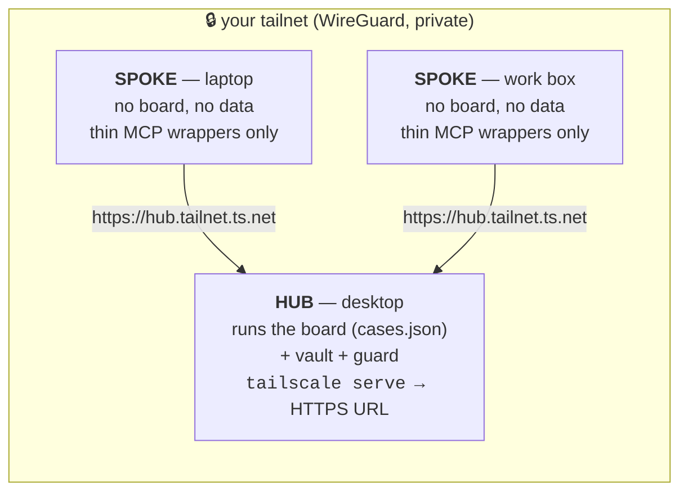
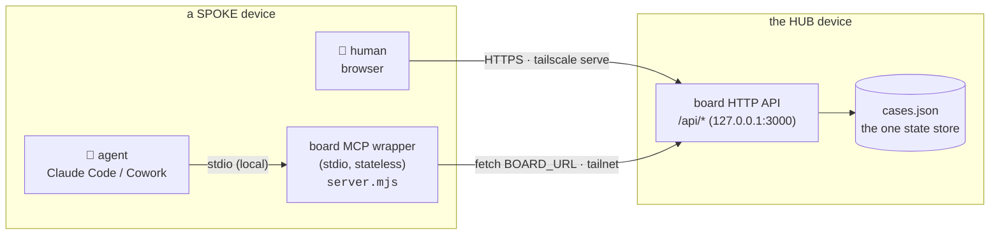
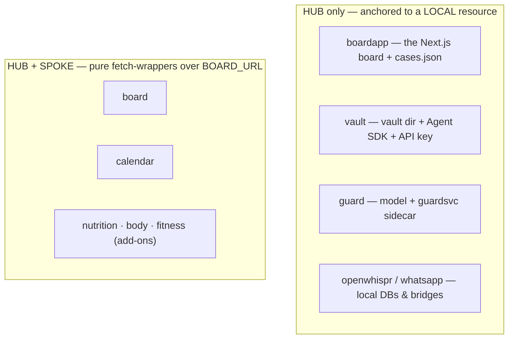

# Multi-device — hub & spoke over Tailscale

Cos is meant to run across several of your machines — a desktop, a laptop, maybe a work
box — but its whole design rests on there being **exactly one board**: one state machine,
one `cases.json`, one `mutate()` chokepoint (see [Overview](overview.md)). Multi-device
support has to add *reach* without adding a *second copy of the state*. The shape that does
that is **hub & spoke**: one device (the **hub**) owns and runs the board; every other device
(a **spoke**) is a thin client that reaches the hub's board over a private
[Tailscale](https://tailscale.com/) tunnel.

!!! tip "The one-line mental model"
    **One board (on the hub). No replication.** Everything else is just *how* a given device
    reaches that single board — a human reaches it by URL, an agent reaches it through a
    local stdio wrapper. A spoke stores nothing.

## Why not one board per device?

The tempting "simple" version is to run a full board on every machine. That quietly breaks
the invariant the rest of the system depends on: you would have *N* independent `cases.json`
files drifting apart — *N* state machines, no single source of truth, nothing meaningful to
back up. The loader refuses this by name:

```sh
# config/load-config.sh
# role=spoke with BOARD_URL still the localhost default means every wrapper
# would talk to a LOCAL board instead of the hub. Fail loudly, naming both keys.
```

So a spoke is *structurally forbidden* from booting a board (`boardapp-run.mjs` refuses on
`COS_DEVICE_ROLE=spoke`, and `ensure-bridges` won't install hub-only services on a spoke).
There is only ever one board to reach.



## Two ways to reach the one board

The thing that makes "just open the URL" feel *almost* right — but not the whole story — is
that Cos has **two** consumers on every device, and they reach the board differently.

| Consumer | How it reaches the board | Runs on a spoke? |
|---|---|---|
| **You (a human, in a browser)** | Open the hub's Tailscale URL (`https://<hub>.<tailnet>.ts.net`) directly. | Nothing to install — just a browser. |
| **The agent (Claude Code / Cowork)** | Through a **local stdio MCP wrapper** that relays each tool call to the hub's HTTP API. | A tiny, stateless relay process — *not* a board. |

For a person, your instinct is exactly right: there is nothing to replicate, you just visit
the URL. The reason a spoke still has *something* running is the **agent** — an MCP client
cannot "enter a URL". Cowork spawns each server as a **direct stdio `command`** and
[does not accept HTTP `url` entries at all](overview.md#why-everything-is-an-mcp); Claude Code
talks to a **local** supergateway bridge on `127.0.0.1`. Either way the client needs a local
process to speak stdio to — and that process is a fetch shim, not a state store.



The wrapper is genuinely thin: its whole job is `CRM_BASE_URL=${BOARD_URL}` → `fetch()`. On
the hub, `BOARD_URL` is `localhost`; on a spoke, it's the hub's tailnet URL. **Same wrapper,
different target** — that one env var is the entire difference between a hub and a spoke MCP.

## What runs on a hub vs a spoke

Every service declares the device roles it runs under (`roles: ["hub"]` or
`["hub","spoke"]`) in its `*.service.json` descriptor. The per-machine generators
(`gen-launchd`, `gen-cowork-config`, `cos-services`, `ensure-bridges`) scope themselves to
this machine's `COS_DEVICE_ROLE`, so a spoke *structurally cannot* install a hub-only service.



The split is **not arbitrary** — there's one rule behind it:

!!! note "The rule: spoke-capable ⇔ its only dependency is the board HTTP API"
    A service can run on a spoke **exactly when** its sole dependency is the board's HTTP API
    (`CRM_BASE_URL=${BOARD_URL}`) — because that dependency is relayable over Tailscale.
    Anything anchored to a **local resource** — the board's own data store, the vault
    directory + `ANTHROPIC_API_KEY`, the guard model/sidecar, the OpenWhispr SQLite DB, the
    WhatsApp bridge — is `hub`-only, because there is nothing to relay: the resource only
    exists where the hub is.

| Service | Roles | Why |
|---|---|---|
| `boardapp` (the board app) | **hub** | Owns `cases.json` — the one state machine. |
| `vault`, `vaultjobs` | **hub** | Needs the vault directory + `ANTHROPIC_API_KEY` (the sole LLM-bearing component). |
| `guard` (+ `guardsvc` sidecar) | **hub** | Needs the local classifier model / sidecar. |
| `openwhispr`, `whatsapp` | **hub** | Wrap a device-local DB / bridge, not the board API. |
| `board`, `calendar` | **hub + spoke** | Thin `fetch()` over `${BOARD_URL}` — relayable. |
| `nutrition`, `body`, `fitness` | **hub + spoke** | Same: add-on wrappers over `${BOARD_URL}`. |

A practical consequence: on a spoke the agent can drive the board, calendar, and the
board-backed add-ons, but vault/guard/voice/WhatsApp verbs live on the hub. That's usually
fine — those are the capabilities that *need* the hub's local resources anyway.

## The Tailscale seam — why the tunnel, not the raw LAN

Given each device connects to the *actual* board, why route it through Tailscale instead of
just binding the board to the network? Because **the board's API is unauthenticated by
design** — it was built to sit on `localhost`, with the UI, the HTTP API, and the MCP all the
same open surface. Two rails keep that surface off the open network:

- **The board binds to `127.0.0.1`**, never `0.0.0.0`. It's exposed to other devices via
  `tailscale serve` — *"never by binding the raw app to `0.0.0.0` (that would serve the
  unauthenticated API to the LAN)"* (`boardapp-run.mjs`).
- **The MCP bridges are pinned to `127.0.0.1`** too, via a loopback preload — supergateway
  ships no bind-host option, so unpinned *"every LAN/tailnet peer could drive the board/vault/
  guard MCPs with zero auth"* (`scripts/loopback-bind.cjs`).

`tailscale serve` supplies exactly what the board itself doesn't: a WireGuard-encrypted,
device-identity-gated, private HTTPS endpoint. So a spoke *does* connect directly to the
board — but only from inside your tailnet, never over coffee-shop Wi-Fi. The genuinely
"simpler" alternative (bind to the LAN, skip Tailscale) is the dangerous one: it publishes a
read/write API of your entire chief-of-staff to everyone nearby.

## Setting a device's role

Role is a single per-machine setting in `config/cos.env` (default `hub`):

```sh
# config/cos.env  (gitignored, per machine)
COS_DEVICE_ROLE=spoke
BOARD_URL=https://hub.your-tailnet.ts.net   # the hub's tailscale serve URL
```

Guardrails make the two easy mistakes loud rather than silent:

- **`COS_DEVICE_ROLE=spoke` + a `localhost` `BOARD_URL`** → the loader refuses to start
  (a spoke pointing at itself would recreate a second state machine).
- **`boardapp` on a spoke** → refuses to boot (a spoke never runs a board).
- **Installing a hub-only service on a spoke** → the generators reject it, naming the role.

The committed `.mcp.json` is deliberately **not** role-scoped (it's a shared artifact); only
the *per-machine* generated configs (launchd plists, the Cowork config) are scoped to
`COS_DEVICE_ROLE`. Set the role once, run the setup skills, and the right services — and only
those — land on the machine.

## See also

- [Overview](overview.md) — the one-board / one-`mutate()` invariant and why everything is an MCP.
- [MCP servers](mcp-servers.md) — the descriptor/manifest model and the two wiring paths.
- [`config/load-config.sh`](https://github.com/philipyaz/cos/blob/main/config/load-config.sh) —
  the role + `BOARD_URL` resolution and its guardrails.
- [`mcp/service-manifest.mjs`](https://github.com/philipyaz/cos/blob/main/mcp/service-manifest.mjs) —
  where `roles` is validated and `currentRole()` is resolved.
