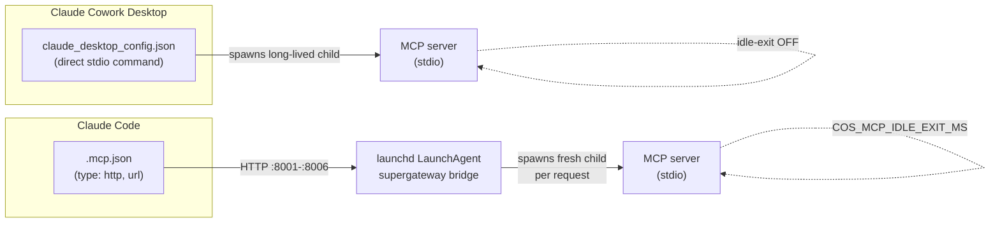

# MCP servers

The MCP layer is **how every local capability reaches the agent**. Claude Cowork — the operator
that drives Cos — runs in a sandbox that **blocks outbound HTTP**. A skill running inside that VM
cannot `fetch` the board API, read the OpenWhispr SQLite store, or call the guard sidecar directly.
So each capability is wrapped as an **MCP server** the operator mounts as a tool surface, and the
network boundary is crossed once, in a place we control, rather than scattered through skill code.

That single design choice — *expose, don't call* — is what makes the whole system sandbox-portable.
It also gives every capability a uniform shape: a stdio MCP server, optionally fronted by an HTTP
bridge, with a consistent lifecycle and (for writes) consistent actor attribution.

## Inventory

**Five core servers** — board, openwhispr, calendar, guard, vault — plus an optional **WhatsApp**
add-on (six in all). Setup is split across skills: [`mcp-bridge-setup`](https://github.com/philipyaz/cos/blob/main/.claude/skills/mcp-bridge-setup/SKILL.md)
wires the four non-voice core servers (board, calendar, guard, vault), while **openwhispr** and
**whatsapp** each have their own setup skill.

| Server | Bridge port | Runtime | Archetype | Role |
| --- | --- | --- | --- | --- |
| **board** | `:8001` | Node (stdio) | Fetch wrapper | The one write path to the board — cases, tasks, notes, messages, reminders, priorities, labels, hierarchy |
| **openwhispr** | `:8002` | Node (stdio) | Local-store reader + watermark | Reads the external OpenWhispr SQLite + audio dir; owns the processed-watermark |
| **calendar** | `:8003` | Node (stdio) | Fetch wrapper | Calendar events on the board, linked to cases |
| **guard** | `:8004` | Node (stdio) | Fetch wrapper (→ sidecar) | Prompt-injection scan + sender whitelist; fronts the guard sidecar |
| **vault** | `:8005` | Node (stdio) + Agent SDK | Embedded agent | Ingest/query the knowledge vault via a headless Claude session |
| **whatsapp** | `:8006` (bridge) · `:8010` (Go sidecar) | Python (stdio) + Go | External two-process bridge | Read/send WhatsApp via an upstream `whatsapp-mcp` checkout |

Sidecars (not in `.mcp.json`; the MCPs call them over HTTP): **search** `:8008`, **guard**
`:8009`, **whatsapp-go** `:8010`.

## Server archetypes

The interesting engineering is that these servers are *not* uniform under the hood. They fall into
four archetypes with very different cost, trust, and statefulness profiles.

### 1. Thin fetch wrapper over the board HTTP API — no LLM

**board · calendar · guard** are pure `fetch` wrappers. Every tool maps to one HTTP route on
`CRM_BASE_URL` (guard's routes hit its sidecar instead); the server never shells out to `curl` and
makes **no LLM calls**. They are cheap, synchronous, and deterministic.

This is the **single-seam principle** made concrete: the board's HTTP API is the *one* write path.
The web UI is the human face of that API; the board MCP is its **agent twin**. Both write through
the same routes — which is why every agent write carries actor attribution (below) so the board's
append-only `activity[]` log can record human vs agent.

!!! note "Reminders and priorities ride the board MCP"
    Reminders (`REM-<n>`) and priorities (`PRI-<n>`) are board-native sub-resources on
    `/api/reminders` and `/api/priorities` — **no new server, port, or `.mcp.json` change**. The
    board server's surface grew; the topology did not.

### 2. Embedded Agent SDK session per call — vault

**vault** is the odd one out and is documented in depth on [The vault agent](vault-agent.md). Where
its siblings are stateless `fetch` calls, each `ingest` / `query` tool call **spawns a full,
short-lived Claude Agent SDK session** (`@anthropic-ai/claude-agent-sdk`) scoped to the vault
filesystem. Two consequences the caller must plan for: it needs an `ANTHROPIC_API_KEY` in its
environment, and each call takes **seconds to minutes** and **costs tokens** — so you batch
material into one `ingest`, never loop.

Because the vault MCP is itself bridged at `vault:8005`, a naïve inner session could re-mount this
server and recurse. The session options are written to make that impossible (`mcpServers: {}` +
`strictMcpConfig: true`, the re-entrant tools in `disallowedTools`, `settingSources: ["project"]`
anchored to the vault cwd) — see [The vault agent](vault-agent.md).

### 3. Local-store reader that owns a watermark — openwhispr

**openwhispr** reads the external [OpenWhispr](https://openwhispr.com) desktop app's store
**directly** — its SQLite DB (`transcriptions.db`, read-only via the `sqlite3` CLI so it is safe
while the app is running under WAL) and the sibling `audio/` dir of `.webm` recordings. OpenWhispr
has no native "mark read", so this server **owns the idempotency primitive**: a single
`{ id, created }` watermark file. `list_transcripts` returns only notes sorting strictly after the
watermark; `mark_processed(id)` advances it. That is the *whole reason this server exists* — it is
what makes the voice loop `list → route → mark` re-runnable at-least-once without re-emitting a
note (see the per-channel-watermark discipline in [the spec](spec.md)).

### 4. External two-process bridge — whatsapp

**whatsapp** wraps a **separate upstream repo** ([`whatsapp-mcp`](https://github.com/verygoodplugins/whatsapp-mcp),
a sibling checkout) and is **two processes**:

- a **Go whatsmeow HTTP sidecar** (`whatsapp-bridge`) that talks to WhatsApp Web, run as a launchd
  sidecar on `:8010` (pinned off upstream's `:8080`, commonly taken; **not** in `.mcp.json`); and
- a **Python stdio MCP**, bridged to the clients on `:8006`.

The Python MCP reads `messages.db` **directly** for all reads, so a triage sweep works even if the
Go sidecar is momentarily down; only tool *calls* that send need the sidecar's REST API. The Go
bridge's bearer token is resolved at runtime from the checkout (`store/.bridge-token`), so the
secret never lands in the installed plist — a token rotation needs no re-render.

## The sidecar pattern

Three capabilities are too heavy or too foreign to live *inside* a Node MCP, so they run as
**HTTP sidecars** beside or behind the MCP that fronts them:

| Sidecar | Port | Why it is a separate process |
| --- | --- | --- |
| **search** | `:8008` | A Python embeddings service; the board calls it for semantic ranking |
| **guard** | `:8009` | A Python FastAPI service hosting the prompt-injection classifier (a HuggingFace model) |
| **whatsapp-go** | `:8010` | A Go whatsmeow daemon — a different runtime entirely from the Python MCP |

The split keeps the MCP layer thin and lets each sidecar pick its own runtime, warm a model once
(rather than per request), and be restarted independently under launchd. The two security-relevant
sidecars embody a **deliberate duality**:

- the [**guard**](../security/guard.md) is a *security control* and **fails CLOSED** — an
  unreachable `:8009` makes `scan_email` return an `UNAVAILABLE → UNTRUSTED` verdict (as non-error
  text, so the agent reads the action rather than retrying);
- [**search**](../reference/search.md) is an *availability accelerator* and **fails OPEN** — an
  unreachable `:8008` silently degrades to keyword ranking with no error.

Same architecture, opposite failure posture, chosen on purpose. Both deep dives live on their own
pages; this page only summarizes them.

## The two wiring paths

Every server is a stdio MCP, but the two clients consume it differently — and that difference
drives the most subtle contract in this layer.

- **Cowork Desktop** spawns each server as a **direct stdio `command`** entry in
  `claude_desktop_config.json`. It does **not** accept HTTP `url` entries — validated; this is why
  Cowork cannot point at the bridges.
- **Claude Code** reaches each server over **`.mcp.json`** (HTTP `url` entries pointing at
  `localhost:8001-8006`), which a **supergateway + launchd HTTP bridge** fronts. Each bridge is a
  LaunchAgent that runs supergateway wrapping the stdio server as Streamable HTTP.

`ensure-bridges.sh` runs at **board boot** to nudge the bridges awake, but it only **WARNs** — it
never blocks the board on a bridge being down.

### The child-lifecycle / idle-exit contract

The shared `packages/mcp-kit` `start()` helper serves **both** consumers, and they have **opposite
lifecycles**. This is genuinely subtle and the source of a classic failure mode:

- **Direct stdio (Cowork / by hand)** — one **long-lived** child for the whole session; the client
  never respawns it. So the **idle-exit timer is OFF by default**. If it were on, an idle-exit here
  would manifest as the dreaded *"server transport closed unexpectedly → MCP not responding"*. A
  real disconnect closes stdin, which reaps the child cleanly (the stdin `end`/`close` backstop is
  always armed).
- **supergateway bridge (Claude Code)** — in stateless StreamableHttp mode supergateway spawns a
  **fresh child per request** and frees it only on child-exit/protocol-error, never on normal
  completion. So idle children **leak**. Each **bridge LaunchAgent therefore opts in** with
  `COS_MCP_IDLE_EXIT_MS=300000`, reaping idle children after 5 minutes (a request in flight disarms
  the timer; supergateway respawns on the next call).

The rule that falls out: `COS_MCP_IDLE_EXIT_MS` lives **only in the bridge plists, never in the
Cowork config**. Turning it on globally would break Cowork; leaving it off everywhere would leak
under Code. The regression is guarded by `tests/mcp-kit-idle.mjs`.

!!! warning "Same env var, two clients, opposite correct values"
    The idle-exit timer is a per-transport decision, not a global one. If you add a new core MCP,
    wire it through `mcp-kit` `start()` and set `COS_MCP_IDLE_EXIT_MS` in the bridge LaunchAgent
    only — do not set it in `claude_desktop_config.json`.

## Actor attribution — the agent twin

Because the board MCP and the board UI write through the same HTTP API, the board needs to know
*who* made each change. Every **write** the MCP issues (anything that isn't a `GET`) is attributed
to the agent two ways, for robustness against either route convention: an **`x-actor: agent`**
header **and** `{ "actor": "agent" }` folded into the JSON body (added even to bodyless writes like
a soft-delete `DELETE`). UI writes are attributed to `human`. The board stamps the resulting
`activity[]` entry accordingly — you never pass `actor` yourself.

The read side is the companion contract: `get_case` surfaces the case's **human-actor** activity as
a leading "Manual actions by the user (human)" block, and these are **authoritative**. An agent
must **never undo a human manual edit** — not a lane move, a task completion, a field edit, or an
archive/restore. When an inference conflicts with a manual action, the agent adds a note or routes
it through the **propose → approve → commit** queue (`propose` / `approve` / `reject`) instead of
overwriting. This human-in-the-loop discipline is what the triage skills lean on — see
[Triage skills](triage-skills.md) and the [Platform API](platform-api.md) for the board contract
those writes hit.

## Where to go next

- [Platform API](platform-api.md) — the board HTTP API these wrappers sit on.
- [The vault agent](vault-agent.md) — the embedded-Agent-SDK server in depth.
- [Triage skills](triage-skills.md) — the operator skills that drive these tools.
- [Prompt-injection guard](../security/guard.md) · [Semantic search](../reference/search.md) — the
  two sidecars, deep.
- [Case hierarchy](hierarchy.md) — the three-tier tree the board tools maintain.
