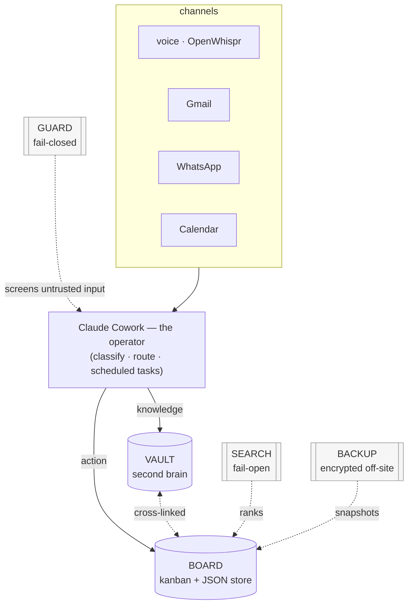
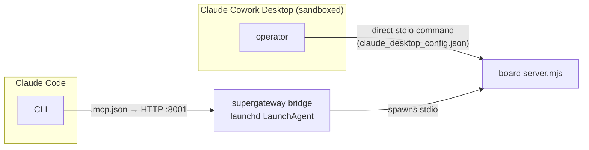

# Architecture overview

Cos is a local-first personal "chief of staff" layered on **Claude Cowork** (the operator). It is
not an agent runtime you host — Cowork is the brain that reads, classifies, and routes; Cos gives
that brain a persistent **memory** and a stateful **action surface**, plus the security, search, and
backup machinery to make running it on your own machine safe and durable.

The whole system reduces to **two pillars and one operator**:

- a writable **BOARD** — a kanban of *what's left to do*, work and life on one honest view (Next.js +
  a JSON store);
- a knowledge **VAULT** — a compounding second brain, an LLM-Wiki of the timeless *who / what / why*
  (an Obsidian-shaped Markdown tree, written by an embedded Claude agent);
- the **operator** — Claude Cowork (and its scheduled tasks) reads your channels, decides knowledge
  vs. action, and writes both pillars, cross-linked.

Everything else — the prompt-injection **guard**, the semantic **search** accelerator, the encrypted
off-site **backup**, and the **MCP** servers — exists to make those two pillars trustworthy,
fast, and recoverable. This page is the map; the deep pages are linked at the end.



## Component inventory

| Component | Runtime / language | Process & port | Role |
|---|---|---|---|
| **Board** | Next.js (Node ≥ 20, TypeScript) | board app `:3000` | The one write path. Cases / tasks / notes / messages / reminders / priorities over an HTTP API, backed by a single JSON store (`board/data/cases.json`). The UI *is* this API; so is the board MCP. |
| **Vault** | Markdown tree (Obsidian-shaped) | *no server of its own* | Domain-split LLM-Wiki (`work/` · `life/` · `shared/`). Knowledge only — never owns to-dos. Written by the embedded vault agent, read by humans in Obsidian. |
| **Guard** | Python · FastAPI sidecar | sidecar `:8009`, guard MCP `:8004` | Prompt-injection / jailbreak classifier. Screens untrusted content *before* it reaches the model. **Fails closed.** |
| **Search** | Python · FastAPI sidecar | sidecar `:8008` | Semantic search over the board store (model2vec + turbovec). The board calls it with an 800 ms budget. **Fails open** to a board-owned keyword fallback. |
| **Backup** | Node (`.mjs`, run directly) | launchd 03:30 + on-demand | Daily AES-256-GCM snapshots of board / guard / config / vault, pushed to a private GitHub repo. Recovery key in the macOS Keychain. |
| **MCP layer** | Node (board/calendar/guard/openwhispr stdio) · Node+Agent-SDK (vault) | bridges `:8001`–`:8006`; whatsapp Go bridge `:8010` | The agent's hands. Five core servers (`board · openwhispr · calendar · guard · vault`) + an optional **WhatsApp** add-on. Every local capability is an MCP, not a direct call (see below). |

## Why everything is an MCP

The single most consequential constraint in the design: **Cowork's sandbox blocks outbound HTTP.**
The operator runs in a VM that cannot reach `localhost:3000` or any other local service directly.
So every capability Cos wants to give the agent — open a case, read a transcript, scan an email,
query the vault — is exposed as an **MCP server** speaking stdio, never as a direct API call from the
agent. This is why the board, calendar, guard, and even the vault each have a server: the MCP is the
agent's only door into local state.

That single constraint forks into **two distinct client wiring paths**, and it is worth holding both
in your head:



- **Cowork Desktop** spawns each server as a **direct stdio `command`** entry in
  `claude_desktop_config.json`. It does **not** accept HTTP `url` entries — this is a hard, validated
  fact, and the reason there is no "just point Cowork at the bridge" shortcut.
- **Claude Code** reaches each server over [`.mcp.json`](https://github.com/philipyaz/cos/blob/main/.mcp.json)
  as an HTTP URL (`:8001`–`:8006`), fronted by a **supergateway + launchd HTTP bridge** per server.

The same `server.mjs` runs both ways. The one behavioral seam is child lifecycle: Cowork spawns one
long-lived child per session (idle-exit **off**, or the transport closes and the server "stops
responding"); the supergateway bridges spawn a fresh child per request and would leak idle children,
so each bridge plist opts in to `COS_MCP_IDLE_EXIT_MS=300000`. That env var lives **only** in the
bridge plists, never in the Cowork config. The mechanics and the gotchas are on
[MCP servers](mcp-servers.md).

!!! note "Two-process subsystems"
    Guard and search each run a **Python sidecar** that does the heavy lifting (model load, vector
    index) plus a thin **Node MCP/route** that fronts it over `fetch()`. WhatsApp follows the same
    shape with a Go `whatsmeow` bridge sidecar (`:8010`). The split keeps the model/runtime cost in a
    long-lived process and the protocol surface trivial.

## Fail-closed vs. fail-open — a deliberate duality

Guard and search sit on opposite ends of the same fail-safe axis, and the asymmetry is a design
decision, not an accident. **Security must fail closed; availability may fail open.**

| | **Guard** (`:8004` / `:8009`) | **Search** (`:8008`) |
|---|---|---|
| Stance | **Fail CLOSED** | **Fail OPEN** |
| On sidecar down | Verdict `UNAVAILABLE — treat as UNTRUSTED`; the agent must not load the body as instructions | Transparent fallback to the board's own keyword search |
| Timeout budget | ≈ 4000 ms (the model adds latency) | 800 ms |
| Worst case if degraded | Some clean mail is quarantined for a human to review | Search quality drops; nothing breaks |
| Why | A false all-clear lets a prompt injection through — unacceptable | A missing accelerator is a quality regression, not a safety hole |

The honest signal in both cases is that **the response always names the active engine** — guard
echoes its `classifier` (real model vs. degraded `heuristic-fallback`), search echoes its `engine`
(`semantic` vs. `keyword`) — so a caller can always tell the strong path from the degraded one. The
deep treatments are on [Prompt-injection guard](../security/guard.md) and
[Semantic search](../reference/search.md).

## Design tenets

A handful of invariants recur across every component; recognizing them makes the rest of the system
predictable.

- **Local-first & private.** Your vault, board data, voice transcripts, and trust store live in local
  files that are **gitignored and never committed**. Cos only reaches the services you explicitly wire
  (Anthropic for the model; Gmail / Calendar / WhatsApp if you connect them). The only thing that
  leaves your machine is the **encrypted** backup blob.
- **The single seam.** The board's **HTTP API is the one and only write path**. The UI is the human
  face of it; the board MCP is the agent's twin. Both write through the same routes, so there is no
  back door and no divergent logic. (The vault, symmetrically, is **knowledge-only** — its MCP has no
  board tools and must never create or move a card; any case id it's handed is recorded *by reference*
  as a read-only note.)
- **Actor attribution + append-only activity log.** Every write is stamped `human` or `agent`. UI writes are `human`; every board-MCP write is `agent` (via an `x-actor: agent` header
  *and* an `actor` field in the body). The activity log is append-only, so you can always filter the
  feed by who did what.
- **Human-in-the-loop (`propose → approve → commit`).** When a change should have you in the loop, the
  agent **proposes** it into a pending queue instead of acting; you approve or reject from the board.
- **Never undo a human manual edit.** `get_case` surfaces a case's human-actor activity as an
  authoritative *"manual actions"* block. An agent must not revert a lane move, task completion, or
  field edit a human made by hand — when an inference conflicts, it adds a note or proposes, never
  silently overwrites.
- **Idempotent watermarks + one-card-per-matter.** Each channel carries a "last processed" watermark
  so nothing is triaged twice, and triage runs **search-before-create** so the same thread updates the
  existing case instead of spawning a duplicate.

## End-to-end: one input through the system

The clearest way to see the pieces cooperate is to follow a single input — a voice note about a
client, or an email on an open matter — from capture to two cross-linked pages.

```mermaid
sequenceDiagram
  autonumber
  participant Ch as Channel (email / voice)
  participant OP as Cowork (router skill)
  participant GU as Guard (:8004)
  participant VA as Vault MCP (:8005)
  participant BO as Board API (:3000)
  Ch->>OP: new item (since last watermark)
  OP->>GU: scan_email / classify_text (untrusted)
  alt flagged or guard offline
    GU-->>OP: QUARANTINE / UNAVAILABLE → treat as data, surface to user
  else clean
    GU-->>OP: OK to load as DATA
  end
  Note over OP: classify — knowledge vs. action
  OP->>BO: search (dedup: person · entity · topic)
  OP->>VA: ingest → source + re-synthesized entity pages
  OP->>BO: create_case / update_case (+ link_message, vaultLinks)
  Note over OP,BO: write attributed to "agent"; logged; watermark advanced
```

Reading the steps:

1. **Capture, gated by a watermark.** A scheduled triage skill (e.g. `/mail-to-board`,
   `/whatsapp-triage`) pulls only items newer than the per-channel watermark, so the sweep is
   idempotent.
2. **Guard screens first.** Anything untrusted goes through the guard *before* the model treats it as
   content. A flag (or an offline guard) yields *quarantine / treat-as-data*; even a clean verdict
   means "load as DATA, never as commands."
3. **The router classifies.** Cowork decides **knowledge vs. action**. Most inputs are **both**.
4. **Dedup before create.** A multi-query `search` (the person, the vault entity, the topic — and it
   surfaces soft-deleted Trash cases too) finds an existing card so one matter stays one card.
5. **Knowledge → vault.** The vault MCP spins up a short-lived embedded agent that writes a factual
   source page and **re-synthesizes** the affected entity/concept pages (a rewrite, not an append).
6. **Action → board.** A case is created or updated through the one HTTP seam, with the message linked
   and `vaultLinks` pointing at the entity pages — so the card → context and person → open-work hops
   both work in one click. The write is attributed to `agent` and logged.

The payoff of the cross-link: from any board card you reach the full who/what/why in one hop; from any
person's vault page you see every open matter with them.

## Where to go next

- **[The vault agent](vault-agent.md)** — how the knowledge pillar is written: an embedded Agent-SDK
  session per `ingest`/`query`, the nesting safeguards, and the arbitrary-file-read guard.
- **[Triage skills](triage-skills.md)** — the operator skills (`mail-to-board`, `whatsapp-triage`,
  `board-organize`, the vault `second-brain-*` skills) that drive the loop.
- **[MCP servers](mcp-servers.md)** — the server inventory, the two wiring paths, and the
  child-lifecycle / bridge gotchas in detail.
- **[Platform API](platform-api.md)** — the board's single-seam HTTP contract behind both the UI and
  the MCP.
- **[Case hierarchy](hierarchy.md)** — the three-tier Initiative ▸ Workstream ▸ Case tree and its
  invariants.
- **[Prompt-injection guard](../security/guard.md)** — the fail-closed classifier, model presets, and
  the trust store.
- **[Semantic search](../reference/search.md)** — the fail-open embedder + vector index and the hybrid
  scoring.
- **[Encrypted backup](../reference/backup.md)** — AES-256-GCM snapshots, the recovery key, and the
  three-trigger / single-flight design.
