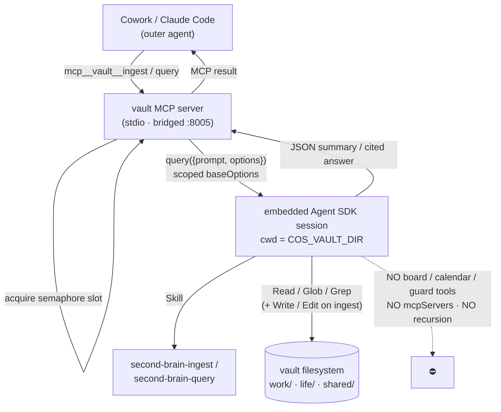

# The vault agent

The **vault** MCP server is the one Cos server that does not just move bytes — it *thinks*. Its
two tools, `ingest` and `query`, each spawn a short-lived, scoped, headless Claude Code session
that synthesizes a domain-split knowledge wiki. This is the knowledge half of Cos (the
[board](../architecture/hierarchy.md) is the action half), and it is built on the **LLM-Wiki**
pattern: sources go in, an agent compiles them into an interlinked, living wiki, and you ask it
questions later.

Source: [`mcp/vault-server/`](https://github.com/philipyaz/cos/blob/main/mcp/vault-server/) ·
[server README](https://github.com/philipyaz/cos/blob/main/mcp/vault-server/README.md) · the
template vault and its skills under
[`vault/example-vault/`](https://github.com/philipyaz/cos/blob/main/vault/example-vault/).

## The one server that embeds an agent

Every other core MCP — [board, calendar, guard](mcp-servers.md) — is a thin `fetch` wrapper
over an HTTP route. They marshal arguments, call a sidecar or the board API, return JSON, and
make **no LLM calls**. They are fast, cheap, and deterministic.

The vault is different by design. It embeds the **Claude Agent SDK**
(`@anthropic-ai/claude-agent-sdk`) and runs a full agent session *per tool call* — a
`query({ prompt, options })` against the SDK. Three consequences follow directly, and you must
plan for all three:

- It needs an **`ANTHROPIC_API_KEY`** in its process environment. The other servers do not.
- Each call takes **seconds to minutes** and **consumes tokens**. It is not a function call; it
  is an agent doing cross-page synthesis.
- It is the only Cos server where the *quality* of the output depends on a model, a prompt, and
  a set of skills rather than on a code path.

!!! note "Why an embedded agent and not a code pipeline"
    Ingesting a source the LLM-Wiki way means *re-synthesizing* the wiki — rewriting every entity
    and concept page the new source touches so the synthesis already reflects everything read. That
    is not a transform you can script; it is judgement. So the vault hands the whole job to an agent
    with filesystem tools and three skills, and constrains *what* that agent can reach rather than
    *how* it reasons.

## The domain-split wiki

The vault is hard-split into two domains that never bleed into each other, plus a small shared
tree for genuinely dual entities:

| Domain | Root | Holds |
| --- | --- | --- |
| work | `work/wiki/` | the venture, the role, advisory, work entities / concepts / sources |
| life | `life/wiki/` | trips, health, admin, family, personal logistics |
| shared | `shared/wiki/entities/` | *truly-dual* entities only — you yourself, the city you live in |

Each domain tree is self-contained: `entities/`, `concepts/`, `sources/`, plus a **strong
`index.md`** and an append-only `log.md`. The domain of an item is decided **at ingest from its
content**, not by a folder choice. A work concept never lands in `life/wiki`; only the
unavoidably-dual entities live in `shared/` and are referenced from both sides. Two vault-root
resources are global: `aliases.md` (the entity-resolution map) and `raw/assets/` (preserved
copies of attached artifacts).

The `index.md` is deliberately *not* a flat list. It is a navigable map whose top-level sections
are **overarching themes**, each grouping its constituent concepts, entities, and sources — so the
query agent enters through the index, finds the relevant theme, and follows `[[wikilinks]]` from
there rather than scanning a directory.

## The skills are the agent's behaviour

The server is plumbing; the *behaviour* lives in three vault-local skills
([`vault/example-vault/.claude/skills/`](https://github.com/philipyaz/cos/blob/main/vault/example-vault/.claude/skills/))
that the embedded session loads. The server picks which skill applies to which route; the skill
defines what "good" looks like.

- **`second-brain-ingest`** (the `ingest` route) — classifies each input's domain, writes a
  factual source page, copies attached files into `raw/assets/`, and then does the work that *is*
  the value: it **re-synthesizes** every affected entity and concept page (rewrite, don't append),
  resolving contradictions in place. A single substantive source touches **~10–15 pages**. It
  resolves every actor to one canonical entity — heuristic first, then `aliases.md` — so a sender
  email, a spoken name, and a written name all collapse to the same page, appending newly
  discovered aliases. Finally it maintains the strong index and appends to the domain log.

- **`second-brain-query`** (the `query` route) — **read-only**. Enters through the strong index,
  follows `[[wikilinks]]`, answers with `[[wikilink]]` citations, and surfaces the `raw/assets/`
  artifacts linked from the pages it cites so you get the original file, not just the synthesis.

- **`second-brain-lint`** — a scheduled integrity pass, **not an MCP route**. It runs over the
  three trees independently and *flags* (never auto-fixes): filename ≠ H1, broken `[[wikilinks]]`,
  orphan pages, strong-index gaps, **cross-domain leaks** (work↔life bypassing `shared/`), and the
  knowledge-only violations below.

## The knowledge-only boundary

The vault holds **knowledge** — facts, context, who/what/why — and *no actionable state*. No
to-dos, statuses, deadlines, reminders, or priorities; those live on the board. The boundary is
enforced at two levels:

- **The embedded session has no board / calendar / guard tools at all.** It cannot create, move,
  or read a board case even if asked. A board case id handed to `ingest` is recorded **by
  reference only** — a read-only `cases:` frontmatter key plus a one-line `**Board:** CASE-N —
  <title>` body note, written verbatim from what it was handed. The vault never derives, verifies,
  or follows a case id, and **never writes the board**.
- **The skills police the content.** Task checkboxes (`- [ ]`) are forbidden on any page; lint
  flags them, along with any legacy `priorities.md` or `reminders/` directory, as knowledge-only
  violations. `query` *declines* a purely open-work question ("what's overdue?") with a one-line
  pointer to the board, then answers the knowledge angle if there is one.

This is the same single-seam discipline as the rest of Cos, applied negatively: the vault is the
one surface that is structurally incapable of touching the action half.

## The interesting engineering: nesting safeguards

This server is itself bridged at `vault:8005` in the repo's `.mcp.json`. A naïve inner agent
session that re-loaded that config would re-mount **this** server and could recurse into
`ingest` / `query` forever, fanning out `claude` subprocesses until something fell over. The whole
reason the SDK `baseOptions` are written out so explicitly is to make that impossible. Four
deliberate settings, belt-and-braces:

| Setting | What it does |
| --- | --- |
| `mcpServers: {}` **+** `strictMcpConfig: true` | The inner agent mounts **no** MCP servers and is forbidden from reading any `.mcp.json` — so it can never re-mount `vault:8005` and recurse. |
| `disallowedTools` | Lists `mcp__vault__ingest` / `mcp__vault__query` (plus `WebFetch` / `WebSearch`); `query` additionally denies `Write` / `Edit`. Even if a server *were* mounted, the re-entrant tools are hard-denied. |
| `settingSources: ["project"]` | Set **explicitly** because the SDK default is version-ambiguous. The inner session loads only the vault-local `CLAUDE.md` + skills, **not** the repo-root config (which carries the full board / guard wiring). |
| `cwd = COS_VAULT_DIR` | The scoped vault, **not** the launchd repo-root working directory — so `"project"` resolves to the vault and `Read/Write/Glob/Grep` are anchored there. |

`permissionMode: "bypassPermissions"` (with `allowDangerouslySkipPermissions`) makes the session
fully non-interactive — there is no human on the other end of a permission prompt behind an MCP.
The session is granted only `Skill`, `Read`, `Glob`, `Grep` (and `Write`, `Edit` for `ingest`).

!!! warning "The first two rows are redundant on purpose"
    `mcpServers: {}` alone should prevent re-mounting; `disallowedTools` alone should prevent
    re-entry. Both are set so that a regression in either one does not reopen the recursion. For a
    server whose failure mode is *unbounded subprocess fan-out*, defense in depth is cheap.

## Path validation — the arbitrary-file-read guard

`ingest.files` is the one place a caller can ask the server to read an arbitrary on-device file.
Before the agent is **ever** invoked, every path is validated: it must be a non-empty **absolute**
path, it is resolved, and it is accepted only if it lives **inside `COS_VAULT_DIR`** or inside one
of the allowlisted `COS_VAULT_ATTACH_DIRS`. Any offending path **rejects the whole call** with an
error naming it — a single bad path fails the batch rather than being silently skipped. For
accepted out-of-vault paths, their parent dirs are passed to the session as
`additionalDirectories` so `Read` can reach them (in-vault paths are already reachable via `cwd`).

## Operational shape

Because every call is a full agent session, the server is built so a bad input can never
crash-loop the KeepAlive'd process:

- **In-process semaphore** (`COS_VAULT_CONCURRENCY`, default **2**) — caps how many embedded
  sessions run at once so simultaneous tool calls don't fan out into N concurrent `claude`
  subprocesses. Batch material into a single `ingest`; don't call it in a tight loop.
- **Per-call timeout / abort** (`COS_VAULT_TIMEOUT_MS`, default 180 s) — on expiry the session is
  aborted and the tool returns a timeout error.
- **Every failure caught** — thrown error, abort/timeout, or SDK-spawn failure (including a
  missing API key) is turned into a clean MCP error result, never an unhandled crash.

### Configuration

| Env var | Required | Default | Purpose |
| --- | --- | --- | --- |
| `ANTHROPIC_API_KEY` | **yes** | — | The embedded SDK calls the Anthropic API. Sourced from the gitignored `config/secrets.env` by `launch.sh`, so it stays out of the installed plist. |
| `COS_VAULT_DIR` | **yes** | — | Absolute vault root → the session's `cwd`. Missing/nonexistent → tools return a clear error, but the process still boots (KeepAlive stays calm). |
| `COS_VAULT_MODEL` | no | `claude-sonnet-4-6` | Model for the embedded session (single model, no fallback). |
| `COS_VAULT_MAX_TURNS` | no | `30` | Max agent turns per session. |
| `COS_VAULT_TIMEOUT_MS` | no | `180000` | Per-call timeout; on expiry the session is aborted. |
| `COS_VAULT_ATTACH_DIRS` | no | *(empty)* | Colon-separated allowlist of dirs **outside** the vault from which `ingest.files` may be read. |
| `COS_VAULT_CONCURRENCY` | no | `2` | Max embedded sessions running at once (the semaphore). |

## Wiring & client paths

The vault runs over stdio. Claude Cowork Desktop spawns it as a direct stdio command; Claude Code
reaches it over `.mcp.json` through a supergateway + launchd HTTP bridge on **`:8005`**. A
`launch.sh` wrapper (the plist's only `ProgramArguments` entry) sources the API key from
`config/secrets.env` before exec'ing supergateway, keeping the secret out of the installed plist.
The [`setup-vault`](https://github.com/philipyaz/cos/tree/main/.claude/skills/setup-vault) skill
bootstraps a private vault from the committed `example-vault` template and points the bridge at it;
[`mcp-bridge-setup`](mcp-servers.md) wires the bridge.

## See also

- [MCP servers](mcp-servers.md) — the thin-wrapper siblings this server is the exception to.
- [Case hierarchy](hierarchy.md) — the action half the vault references but never writes.
- [Prompt-injection guard](../security/guard.md) — the fail-closed counterpart that gates inbound text.
- [Semantic search](../reference/search.md) — the separate fail-open retrieval accelerator over board data.
- [Deep feature tour](../reference/deep-features.md) — end-to-end walkthroughs including ingest/query in context.
