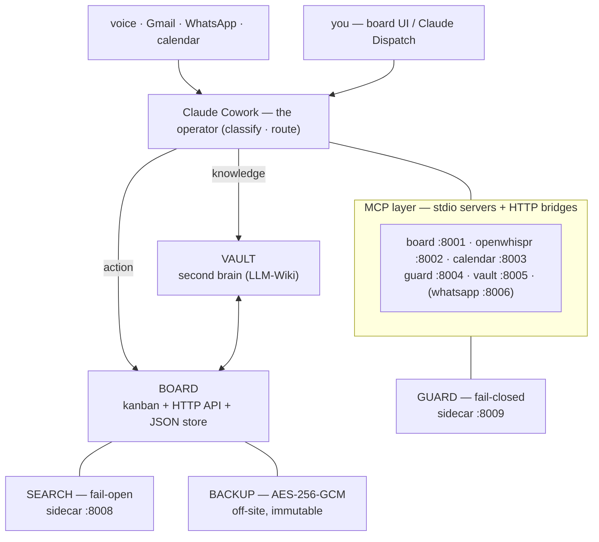

# Cos — technical documentation

Cos is a local-first personal *chief of staff* layered on **Claude Cowork** (the operator that
reads, classifies, and routes). It is built around two pillars — a writable **board** (an
action/kanban surface, Next.js + a JSON store) and a knowledge **vault** (an LLM-Wiki second
brain) — fronted by a fail-closed prompt-injection **guard**, a fail-open semantic **search**
accelerator, encrypted off-site **backup**, and the **MCP servers** that expose all of it to
agents. This site is the technical and architecture reference; the
[README on GitHub](https://github.com/philipyaz/cos) is the quickstart and runbook.

## Topology

The shape is two pillars under one operator. Cowork drives both surfaces over MCP; so do you,
through the board UI. The board's HTTP API is the single write path — the UI is the human face
of it, each MCP tool is the agent twin of a board verb.

## The architecture spine

Start with the Overview, then read down the spine. Each page is a self-contained deep-dive on one
seam of the system.

-   :material-sitemap:{ .lg .middle } __Overview__

    ---

    The whole-system map: the two pillars, the single-seam write path, actor attribution and the
    append-only activity log, and the propose → approve → commit loop that keeps a human in charge.

    [:octicons-arrow-right-24: Architecture overview](architecture/overview.md)

-   :material-brain:{ .lg .middle } __The vault agent__

    ---

    How the LLM-Wiki second brain ingests sources and *re-synthesizes* interlinked pages, so one
    note can rewrite a dozen connected ones — and how the vault MCP exposes it.

    [:octicons-arrow-right-24: The vault agent](architecture/vault-agent.md)

-   :material-filter-variant:{ .lg .middle } __Triage skills__

    ---

    The Cowork operator skills (`mail-to-board`, `whatsapp-triage`, `board-organize`) — idempotent
    per-channel watermarks, one-card-per-matter dedup, and the rule that a manual edit is never
    undone.

    [:octicons-arrow-right-24: Triage skills](architecture/triage-skills.md)

-   :material-connection:{ .lg .middle } __MCP servers__

    ---

    The five core servers plus the WhatsApp add-on, and the two wiring paths: Cowork's direct stdio
    spawn vs. Claude Code's supergateway + launchd HTTP bridges on :8001–:8006.

    [:octicons-arrow-right-24: MCP servers](architecture/mcp-servers.md)

-   :material-api:{ .lg .middle } __Platform API__

    ---

    The board HTTP API as the one write path: board verbs, actor attribution, the activity log, and
    the approval queue that the UI and every MCP tool both call.

    [:octicons-arrow-right-24: Platform API](architecture/platform-api.md)

-   :material-file-tree:{ .lg .middle } __Case hierarchy__

    ---

    The Initiative → Workstream → Case structure that organizes everything on the board, and how
    cards roll up and link to vault context.

    [:octicons-arrow-right-24: Case hierarchy](architecture/hierarchy.md)

## Security & subsystems

-   :material-shield-lock:{ .lg .middle } __Prompt-injection guard__

    ---

    A fail-closed scanner that reads untrusted mail *before* the agent does. A down or cold scanner
    treats content as untrusted — never a false all-clear. Deep dive on the classifier, threshold,
    and quarantine.

    [:octicons-arrow-right-24: Guard](security/guard.md)

-   :material-magnify:{ .lg .middle } __Semantic search__

    ---

    An on-device semantic-search sidecar (turbovec + model2vec) with a keyword fallback. Fail-open
    by design: a down index degrades to keyword search rather than blocking a read.

    [:octicons-arrow-right-24: Search](reference/search.md)

-   :material-backup-restore:{ .lg .middle } __Encrypted backup__

    ---

    Daily AES-256-GCM snapshots of the live data pushed to a private repo with immutable git
    history; the recovery key lives in the macOS Keychain. Bootstrap, restore, and key rotation.

    [:octicons-arrow-right-24: Backup](reference/backup.md)

-   :material-book-open-variant:{ .lg .middle } __Deep feature tour__

    ---

    The engineering-level inventory: models, algorithms, crypto, schema-versioned store, and the
    full MCP tool surface.

    [:octicons-arrow-right-24: Deep feature tour](reference/deep-features.md)

## Principles

These tenets show up repeatedly in the design and explain most of the non-obvious choices.

- **Local-first & private.** Email, messages, voice notes, and the vault stay on your machine —
  local files, gitignored, never committed. Cos only reaches the services you explicitly wire.
- **Fail-closed security vs. fail-open availability.** A deliberate duality: the guard *fails
  closed* (a down scanner treats content as untrusted), while search *fails open* (a down index
  degrades to keyword results). Safety blocks; convenience degrades.
- **Human-in-the-loop.** The agent **proposes, you approve**. Outward and consequential actions go
  through a board approval queue (`propose → approve → commit`), every write is attributed to
  `human` / `agent` / `system` in an append-only activity log, and a human manual edit is never
  silently undone.

!!! tip "Contributing to the docs"
    These pages are an [MkDocs](https://www.mkdocs.org/) site
    ([Material theme](https://squidfunk.github.io/mkdocs-material/)) under `docs/`, published to
    GitHub Pages on every push to `main`. To add or change a page, edit the Markdown under `docs/`
    and wire it into the `nav:` in `mkdocs.yml` — don't drop loose Markdown files at the repo root.
    Preview locally with `uvx --with mkdocs-material mkdocs serve`, and validate cross-links with
    `uvx --with mkdocs-material mkdocs build --strict`.
