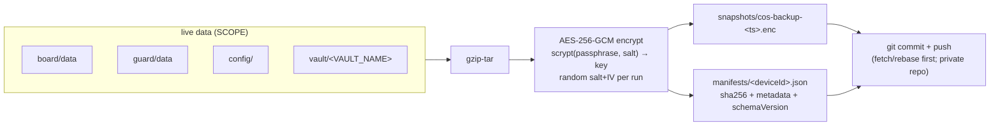

# Encrypted off-site backup — the durable layer

The board (`board/data/`), the guard's quarantine store (`guard/data/`), `config/`, and the
**active vault** are **live data, not test fixtures**. The board's local rolling snapshots
(`board/data/backups/`) are crash-safety only — same-disk, count-pruned, and trivially deletable
with the thing they protect. They survive a bad write; they do **not** survive a disk loss, a
`rm -rf`, or a corruption that propagates before anyone notices.

This subsystem is the missing layer: **daily AES-256-GCM-encrypted snapshots pushed to a private
GitHub repo**, where git history is an immutable, off-site, versioned record you cannot silently
overwrite. The whole design follows from one incident — live data was bulk-edited and the only
backups were the local, count-pruned kind, so the pre-edit state was already gone.

Setup and recovery run through the **`/backup-recovery`** skill
([SKILL.md](https://github.com/philipyaz/cos/blob/main/.claude/skills/backup-recovery/SKILL.md));
the implementation lives in [`backup/`](https://github.com/philipyaz/cos/blob/main/backup/README.md).
This page is the architecture and the contracts.

## The pipeline

A backup is a single immutable artifact per run. [`backup.mjs`](https://github.com/philipyaz/cos/blob/main/backup/backup.mjs)
archives the in-scope stores, encrypts the tarball, writes one file plus a manifest entry into
the backup repo, and commits + pushes.



**Multi-producer safe — and single-producer by lease.** Each machine writes only its own
`manifests/<deviceId>.json` (the pre-split single `MANIFEST.json` is still read, never
written), every run converges with the remote before producing (fetch + rebase, with one
converge-and-retry on a rejected push), and a machine's **first** run into an archive with
history must decrypt-verify the newest snapshot with its local key (*producer admission*) —
a wrong key is refused before it can silently split the archive into two
mutually-unrestorable halves. On top of that, a tiny **plaintext `HUB.json` lease** names
the ONE machine allowed to produce (the hub): the holder renews it on every run with a
git-level compare-and-swap (`--force-with-lease` pinned to the just-fetched ref); a machine
that finds a **fresh** lease held elsewhere quarantines its stray state once
(`orphan/<deviceId>-<ts>.enc` — preserved, never discarded) and exits **4** (a benign,
calm skip, like the lock's exit 3); a **stale** lease (>26h unrenewed) is claimable with an
epoch bump — that is the handover. A machine whose `COS_DEVICE_ROLE` is `spoke` never
produces at all.

The scope is declared in [`config.mjs`](https://github.com/philipyaz/cos/blob/main/backup/config.mjs)
(`SCOPE`). The vault entry is the subtle one: it is resolved as `vault/<VAULT_NAME>` from
`config/cos.env`, the *same* active vault that `setup-vault` records, so a renamed or relocated
vault is never silently dropped. If the configured vault directory is missing at backup time,
`backup.mjs` emits a loud `WARN` (surfaced in the `/backups` log tails) rather than quietly
shipping a snapshot without it.

Encryption ([`lib/crypto.mjs`](https://github.com/philipyaz/cos/blob/main/backup/lib/crypto.mjs))
is authenticated AES-256-GCM. The key is derived from the recovery passphrase via **scrypt** with a
**random salt and IV per backup** — so two backups of identical bytes produce different ciphertext,
and the GCM auth tag makes any post-hoc edit detectable. One file per run, `snapshots/cos-backup-<ts>.enc`,
**never overwritten**: the off-site versioning is git history itself, not a mutable "latest".

## The recovery key — the part to get exactly right

!!! warning "One passphrase, no recovery"
    A single high-entropy passphrase is the **only** way to decrypt. Lose it and the backups are
    unrecoverable **by design** — that is the entire point of encrypting before pushing off-site.
    Treat it like a root credential.

The key lives in the **macOS login Keychain** (`security` item `cos-backup-key`) and is read at
backup time by the LaunchAgent. It is **never** written to this repo, to the backup repo, or to any
log. The protocol is two-copy: Keychain (for automated daily runs) **plus** one offline copy in a
password manager (for the day the Keychain is gone — e.g. a new machine). For one-off or CI restores
before the Keychain item exists, `COS_BACKUP_KEY` (env) overrides the Keychain lookup in
`resolveKey()`.

Rotation re-keys *new* snapshots only; it does **not** re-encrypt old ones — they still need the old
key, so the retired key stays archived offline, labelled with the cutover date.

## Operational design — three triggers, one floor

The hard guarantee is the **launchd 03:30 daily floor**
([`com.chiefofstaff.backup.plist.template`](https://github.com/philipyaz/cos/blob/main/backup/deploy/com.chiefofstaff.backup.plist.template)).
While the board is running it *adds* two more triggers of the **same** `backup.mjs` — a manual
button and an opportunistic top-up — so a machine that's awake and in use is backed up well inside
the daily window, while a machine that's only ever asleep at 03:30 still gets caught at next wake.

| Trigger | Source | Gate |
|---|---|---|
| **Daily floor** | launchd at 03:30 | none — always runs |
| **Back up now** | `POST /api/backups/run` (button on `/backups`) | none; `?force=1` also bypasses the freshness gate |
| **Opportunistic top-up** | fired non-blocking from hot read routes (`GET /api/cases`, `GET /api/backups`) | only when newest snapshot is older than the 12h freshness window **and** a positive live-board identity check passes |

The board side ([`board/lib/backup-status.ts`](https://github.com/philipyaz/cos/blob/main/board/lib/backup-status.ts))
gates the top-up; it never blocks the request it piggybacks on.

### Single-flight lock + exit codes

All three callers serialize on one exclusive `.backup.lock` inside the backup repo (atomic `wx`
create, gitignored, reclaimed if a crashed run left it >120s stale). The lock lives in `backup.mjs`,
**not** in board code, precisely because launchd runs the file *directly* and never passes through
the board. The exit code is the contract every caller reads:

| Exit | Meaning | Failure? |
|---|---|---|
| `0` | snapshot written **and pushed** | no — healthy |
| `2` | committed **locally only** (push failed, e.g. no network) — still a real backup | no |
| `3` | benign **lock-skip** — another run held the lock, this one did nothing | no |
| `1` | fail-closed **repo-guard refusal** (see below) | yes |
| other non-zero | hard failure | yes |

!!! note "Exit 2 and 3 are not failures — but a STANDING push outage is"
    `2` means the snapshot is committed and just needs a later push; `3` means another trigger was
    already running. Health checks (and the `/backups` verdict) treat a single non-`0/2/3` exit as a
    real failure — and additionally escalate to **error** when the oldest *unpushed* commit is more
    than 24h old: each run "succeeded" locally, but the off-site channel has been dead for a day+,
    which is a safety failure, not a cosmetic warning.

### Fail-closed repo guard

The effective backup repo path resolves by precedence — `COS_BACKUP_REPO` env override **>**
`config/cos.env BACKUP_REPO` **>** the `~/.cos-backups` default. The **EXPECTED** repo is derived
from `cos.env` (the config value, *not* the env var). Before doing anything,
`assertDefaultRepoOrRefuse()` exits `1` unless the effective repo `===` EXPECTED — so a
`COS_BACKUP_REPO=/tmp/...` override is **refused rather than pushed to**. This is the same fail-closed
instinct as the [Guard](../security/guard.md): when the target is ambiguous, stop. The escape hatch
`COS_BACKUP_ALLOW_NONDEFAULT=1` is reserved for deliberate disposable-repo tests. Consequently
`COS_BACKUP_REPO` is *not* the relocation knob — to move the repo you edit `cos.env` (keeping
effective `===` EXPECTED) and reinstall the agent.

## Restore — verify before you touch anything

[`restore.mjs`](https://github.com/philipyaz/cos/blob/main/backup/restore.mjs) inverts the pipeline,
and its ordering is the whole safety story: **nothing is written until the snapshot has fully
verified, and the live state is itself snapshotted before any overwrite**, so a restore is reversible.

```mermaid
sequenceDiagram
  participant R as restore.mjs
  participant Repo as backup repo
  participant FS as live stores
  R->>Repo: sync (fetch/ff — HARD-fails if unreachable or diverged; --stale-ok escapes)
  R->>R: pick snapshot — THIS device's latest (--device / --any-device for cross-machine)
  R->>R: decrypt → GCM auth tag verify
  R->>R: sha256 vs the manifest entry
  R->>R: every *.json parses
  alt verification fails
    R-->>R: refuse (bad magic / tag throw / mismatch)
  else dry-run (default)
    R-->>R: report OK, write nothing
  else --apply
    R->>R: refuse if anything answers on $BOARD_URL (--allow-live-board escapes)
    R->>FS: copy current state → ~/cos-recovery/pre-restore-&lt;ts&gt;/
    R->>FS: overwrite live stores (vault mapped to local VAULT_NAME; jobs.json stripped; Obsidian identity kept)
  end
```

Verification is a three-gate chain — GCM auth tag, then sha256 against the manifest, then a JSON
parse of every store — and the default is **dry-run**; `--apply` is required to write. On `--apply`,
the current live stores are copied to `~/cos-recovery/pre-restore-<ts>/` **before** the overwrite, so
the restore can itself be undone. A snapshot that fails to verify (`bad magic`, an auth-tag throw, a
sha256 mismatch) is never applied — the remedy is an earlier `--date`, not a force.

## Board health surface

The board exposes a **read-only** health view at **`/backups`** (sidebar → Review → Backups — a
top-level item next to Security/Trash/Activity, not nested under Security), served by
`board/lib/backup-status.ts` over `GET /api/backups`. That route is **always 200** with a fail-safe
envelope: a never-broken health page is more useful than one that errors when the thing it monitors
is broken. It renders a `healthy` / `warning` / `error` verdict, last-run facts (time, size, store
count), push state, snapshot history, log tails, repo-path provenance, and a readiness checklist.

Two properties matter for the threat model. The readiness probe is **read-only and offline** — it
checks the recovery key's *existence* with `security find-generic-password` **without `-w`** (it never
reads the secret) and never touches the network. And `POST /api/backups/run` — the one mutating route,
which spawns the same `backup.mjs` — `403`s on a non-live-board (sandbox) context, so the agent twin
can't fire backups from a test fixture.

## Threat model / guarantees

| Property | Mechanism |
|---|---|
| **Off-site** | pushed to a private GitHub repo — survives local disk loss or `rm -rf board/data/backups` |
| **Immutable** | git history keeps every daily snapshot; one file per run, never overwritten |
| **Confidential** | AES-256-GCM before push — a leak of the private repo exposes nothing without the key |
| **Tamper-evident** | GCM auth tag + manifest sha256 — a modified snapshot fails verification, never restores |
| **Reversible** | `--apply` snapshots current state to `~/cos-recovery/` before any overwrite |
| **Serialized** | one exclusive `.backup.lock` (120s stale-reclaim) keeps the three callers from interleaving a push |

## See also

- [Architecture overview](../architecture/overview.md) — where backup sits among the subsystems.
- [Prompt-injection guard](../security/guard.md) — the other fail-closed control, and the sibling of
  this subsystem's repo guard.
- [Semantic search](search.md) — the deliberate counterpoint: a subsystem that fails *open*.
